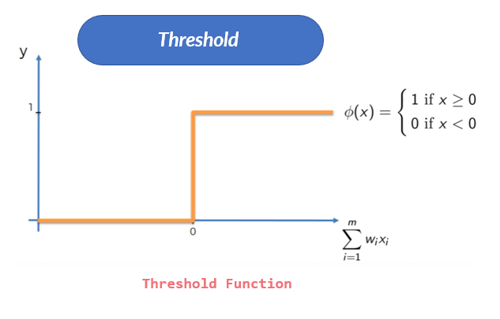
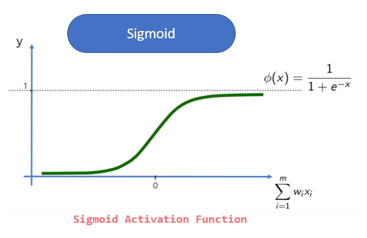
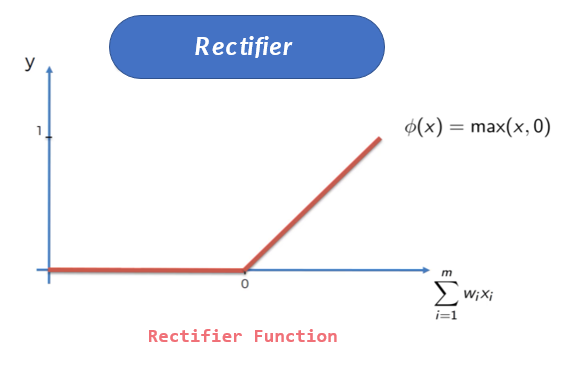
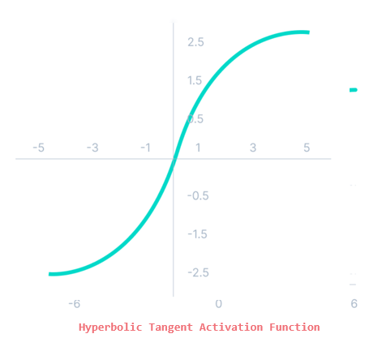

# Artificial Intelligence

Eventhough AI Machines seem to be a threat to humanity, yet, they cannot beat the power of human intelligence, Machines will never beat the creative or imaginative ability of humans. 
Always remember, humans created the machine.

## What is AI?
 "It is a branch of computer science by which we can create intelligent machines which can behave like a human, think like humans, and able to make decisions." 

setup google codeLab [Open-Link](https://codelabs.developers.google.com/)

Theres always been this lask of understanding between machine learning and artificial intelligence.
Put in context, artificial intelligence refers to the general ability of computers to emulate human thought and perform tasks in real-world environments, while machine learning refers to the technologies and algorithms that enable systems to identify patterns, make decisions, and improve themselves through experience.

##  Artificial Neural Network (ANN)
 Artificial Neural Networks the most important part of the deep learning model, they are the brain inspired deep learning tool which replicate the way humans learn. 

 ***The Neuron***

 In the Human Body, the Neuron is a part of the brain and nervous system. The three broad functions of the CNS are:
 
 - To take in sensory information

 - process information, and

 - To send out motor signals.

  

  ***But Now How do Neurons Connect?***

  Neurons communicate with each other by sending chemicals, called neurotransmitters, across a tiny space called a synapse, between the axons and dendrites of nearby neurons.

  

 So, now that we have that understanding of a human neuron, and how the neurons connect, the goal of AI was to replicate the way the human brain learns. In another sence, create machines that would have the ability to learn, adapt, and make decisions.

## Neurons in AI

 As seen in the diagram below, the Input Values are independent Variables of [1, 2, and m]. These variables need to be standardized to make sure all variables contribute evenly to a scale when items are added together, or to make it easier to interpret results of a regression or other analysis.
 The ***output*** Value can be: continuous, binary or a catagorical variable. Neural network is made of interconnected neurons. Each of them is characterized by its weight, bias, and activation function.

  

### Weight
  Weight is the parameter within a neural network that transforms input data within the network's hidden layers. 

### Bias
  Bias in AI is when the machine gives consistently different outputs for one group of people compared to another. Typically these bias outputs follow classical societal biases like race, gender, biological sex, nationality or age.
### Neural Network Activation Function?
 An Activation Function is what makes the decision, if a neuron should be activated or not. This means that an ctivation Function is a mathematical “gate” that decide whether the neuron’s input to the network is important or not in the process of prediction using simpler mathematical operations. 

  ***Types of Activation Functions***

  - ***Threshold Activation Function***
     is a commonly used activation function.It gives 1 as output of the input is either 0 or positive. If the input is negative, it gives 0 as output.
     

  - ***Sigmoid Activation Function***
    Sigmoid Function is the most commonly used activation function in neural networks. It is the go-to model when it comes to predicting the probability as an output. Since probability of anything exists only between the range of 0 and 1, sigmoid has the ability to takes any real value as input and outputs values in the range of 0 to 1.
      
 
  - ***Rectifier Activation Function***
    is the most popularly used activation function in the areas of convolutional neural networks and deep learning. It is of the form:
    

  - ***Hyperbolic Tangent Activation Function***
    It is bipolar in nature. Similar to sigmoid, except a different output range of -1 to 1. In Tanh, the larger the input (more positive), the closer the output value will be to 1.0, whereas the smaller the input (more negative), the closer the output will be to -1.0.
    

### How do Neural Networks Work?
   Example Case: Real Estate Price prediction using a trained NN. 
   

 - Looking at the ***Red*** arrows, this synapses connects Age, Area, bedroom to a neuron. 
   So, this neuron is paying attention to properties that maybe:
   Newer,
   That have at least 3 bedrooms or more,
   And which the homes have a larger area.

 - Looking at the ***Blue*** arrows, this synapses connects Schools Ratings and bedroom to a neuron. 
   So, this neuron is paying   attention to properties that maybe:
   Families with Kids in school
   Homes that have more bedrooms for the parents and kids.

 - Looking at the ***Green*** arrows, this synapses connects Just the Age of the property.
   So, this neuron is paying attention to properties that maybe:
   Newly built, or
   Properties that are historic, valuable properties, like above 100years old. 
   A rectifier function can be used here, stating that, the moment the property turns 100 years, 
   the rectifier functions kicks from 0 to 1. 

 - Looking at the ***Yellow*** arrows, this synapses connects Area (SqFt) and Bedrooms of the property. 
   So, this neuron is paying attention to properties that maybe:
   The homes here have a larger Area Sq and have many rooms. These may be homes that are mansions. 

 - Looking at the ***black*** arrows, this synapses connects all the input functions. So, this neuron is 
   paying attention to properties because all the inputs match the criteria for the price of the property

   So, all these different neuron communications will predict the price of the property

### How do Neural Networks Learn?
ANN can be categorized by how the data flows from the input node to the output node. B
Some of the neural networks are some examples:

 ***Gradient descent***
    is an optimization algorithm which is commonly-used to train machine learning models and neural networks. 
    Training data helps these models learn over time, and the cost function within gradient descent specifically 
    acts as a barometer, gauging its accuracy with each iteration of parameter updates.

 ***Backpropagation algorithm***
    Artificial neural networks learn continuously by using corrective feedback loops to improve their predictive analytics. In simple terms, you can think of the data flowing from the input node to the output node through many different paths in the neural network. Only one path is the correct one that maps the input node to the correct output node. To find this path, the neural network uses a feedback loop, which works as follows:

Each node makes a guess about the next node in the path.
It checks if the guess was correct. Nodes assign higher weight values to paths that lead to more correct guesses and lower weight values to node paths that lead to incorrect guesses.
For the next data point, the nodes make a new prediction using the higher weight paths and then repeat Step 1.
Convolutional neural networks
The hidden layers in convolutional neural networks perform specific mathematical functions, like summarizing or filtering, called convolutions. They are very useful for image classification because they can extract relevant features from images that are useful for image recognition and classification. The new form is easier to process without losing features that are critical for making a good prediction. Each hidden layer extracts and processes different image features, like edges, color, and depth.

### Machine Learning in ANNs
 These ML algorithms help to solve different business problems like Forecasting, Regression, Clustering, Classification, and Associations, etc.
 Machine learning is divided into mainly four types, which are:

- ***Supervised Machine Learning*** -
  Ex: Housing Price Prediction.
  A Supervised machine learning is a technique where we train the machines using the "labelled" dataset, and based on the training, the machine predicts the output. In this type of learning, the labelled data specifies that some of the inputs are already mapped to the output. The machine are First trained with the input and corresponding output, and then we ask the machine to predict the output using the test dataset. A classic example will be the example of training a machine with

- ***Unsupervised Machine Learning***
  EX: Customer Segmentation and Market Basket Analysis.
  In unsupervised machine learning, the machine is trained using the unlabeled dataset, and the machine predicts the output without any supervision. In this type, the models are trained with the data that is neither labelled nor classified, and the model acts on that data without any supervision. Unsupervised learning is much similar as a human learns, which makes it closer to the real AI.

- ***Semi-Supervised Machine Learning***
  Ex: Lane-Finding on GPS data.
  It represents the intermediate ground between Supervised and Unsupervised learning algorithms and uses the combination of labelled and unlabeled datasets during the training period.

- ***Reinforcement Learning***
  Ex: Drivless Cars.
  Reinforcement learning works on a feedback-based process, in which an AI agent automatically explore its surrounding by hitting & trail, taking action, learning from experiences, and improving its performance. Agent gets rewarded for each good action and get punished for each bad action; hence the goal of reinforcement learning agent is to maximize the rewards.
  In reinforcement learning, there is no labelled data like supervised learning, and agents learn from their experiences only.

  For more on this section, see this javatpoint Link: [Click-Link](https://www.javatpoint.com/types-of-machine-learning)
