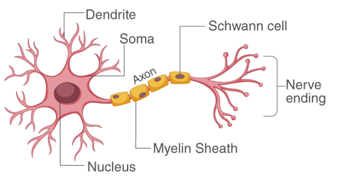
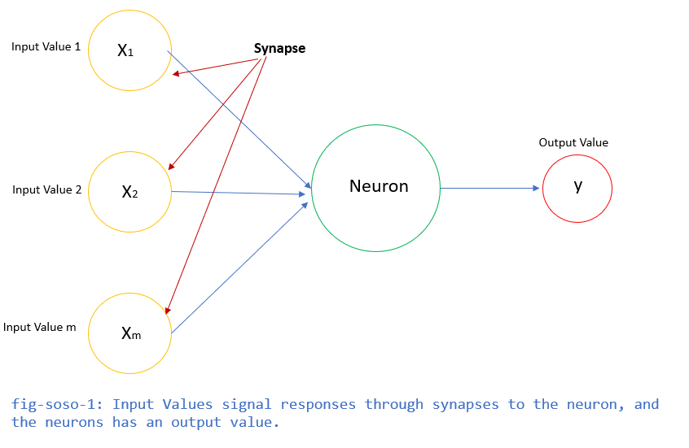

# Artificial Intelligence

Eventhough AI Machines seem to be a threat to humanity, yet, they cannot beat the power of human intelligence, Machines will never beat the creative or imaginative ability of humans. 
Always remember, humans created the machine.

## What is AI?
 "It is a branch of computer science by which we can create intelligent machines which can behave like a human, think like humans, and able to make decisions." 

setup google codeLab [Open-Link](https://codelabs.developers.google.com/)

Theres always been this lask of understanding between machine learning and artificial intelligence.
Put in context, artificial intelligence refers to the general ability of computers to emulate human thought and perform tasks in real-world environments, while machine learning refers to the technologies and algorithms that enable systems to identify patterns, make decisions, and improve themselves through experience.

##  Artificial Neural Network (ANN)
 Artificial Neural Networks the most important part of the deep learning model, they are the brain inspired deep learning tool which replicate the way humans learn. 

 ***The Neuron***

 In the Human Body, the Neuron is a part of the brain and nervous system. The three broad functions of the CNS are:
 
 - To take in sensory information

 - process information, and

 - To send out motor signals.

  

  ***But Now How do Neurons Connect?***

  Neurons communicate with each other by sending chemicals, called neurotransmitters, across a tiny space called a synapse, between the axons and dendrites of nearby neurons.

  

 So, now that we have that understanding of a human neuron, and how the neurons connect, the goal of AI was to replicate the way the human brain learns. In another sence, create machines that would have the ability to learn, adapt, and make decisions.

 ### Neurona in AI

 As seen in the diagram below, the Input Values are independent Variables of [1, 2, and m]. These variables need to be standardized to make sure all variables contribute evenly to a scale when items are added together, or to make it easier to interpret results of a regression or other analysis.

  

### Machine Learning in ANNs

These ML algorithms help to solve different business problems like Forecasting, Regression, Clustering, Classification, and Associations, etc.
Machine learning is divided into mainly four types, which are:

- ***Supervised Machine Learning*** -
  Ex: Housing Price Prediction.
  A Supervised machine learning is a technique where we train the machines using the "labelled" dataset, and based on the training, the machine predicts the output. In this type of learning, the labelled data specifies that some of the inputs are already mapped to the output. The machine are First trained with the input and corresponding output, and then we ask the machine to predict the output using the test dataset. A classic example will be the example of training a machine with

- ***Unsupervised Machine Learning***
  EX: Customer Segmentation and Market Basket Analysis.
  In unsupervised machine learning, the machine is trained using the unlabeled dataset, and the machine predicts the output without any supervision. In this type, the models are trained with the data that is neither labelled nor classified, and the model acts on that data without any supervision. Unsupervised learning is much similar as a human learns, which makes it closer to the real AI.

- ***Semi-Supervised Machine Learning***
  Ex: Lane-Finding on GPS data.
  It represents the intermediate ground between Supervised and Unsupervised learning algorithms and uses the combination of labelled and unlabeled datasets during the training period.

- ***Reinforcement Learning***
  Ex: Drivless Cars.
  Reinforcement learning works on a feedback-based process, in which an AI agent automatically explore its surrounding by hitting & trail, taking action, learning from experiences, and improving its performance. Agent gets rewarded for each good action and get punished for each bad action; hence the goal of reinforcement learning agent is to maximize the rewards.
  In reinforcement learning, there is no labelled data like supervised learning, and agents learn from their experiences only.

  For more on this section, see this javatpoint Link: [Click-Link](https://www.javatpoint.com/types-of-machine-learning)