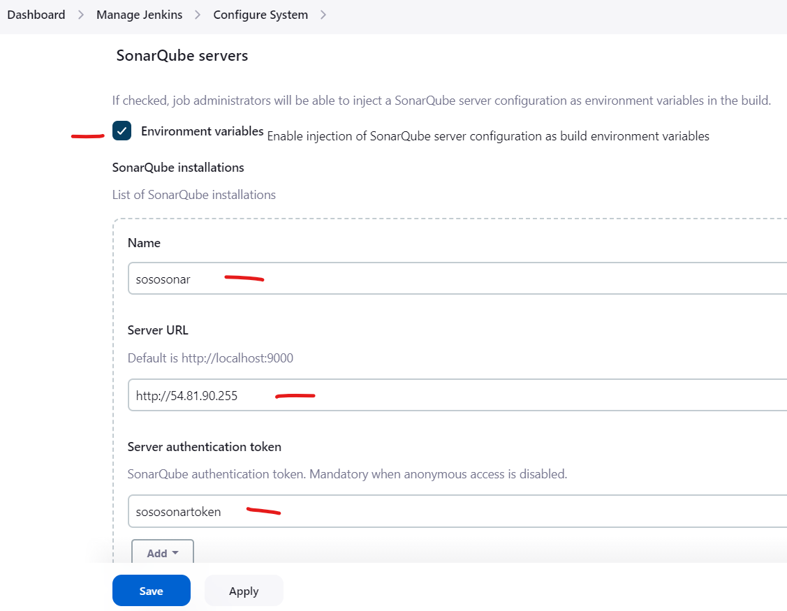

# Install servers 
Install Individuals servers for:
- Nexus
- Sonarqube
- Jenkins

***After Installing Servers***

- Add Sonar security group (All Traffic) in the Jenkins server security Group in AWS Console.
- Also, Jenkins security group (All Traffic) in the Sonar server security Group in AWS Console.

## Nexus
- Centos 7 (Amazon Market place)
- TCP Port ***8081*** from MyIP and Jenkins-SG


```sh
#!/bin/bash
yum install java-1.8.0-openjdk.x86_64 wget -y   
mkdir -p /opt/nexus/   
mkdir -p /tmp/nexus/                           
cd /tmp/nexus/
NEXUSURL="https://download.sonatype.com/nexus/3/latest-unix.tar.gz"
wget $NEXUSURL -O nexus.tar.gz
EXTOUT=`tar xzvf nexus.tar.gz`
NEXUSDIR=`echo $EXTOUT | cut -d '/' -f1`
rm -rf /tmp/nexus/nexus.tar.gz
rsync -avzh /tmp/nexus/ /opt/nexus/
useradd nexus
chown -R nexus.nexus /opt/nexus 
cat <<EOT>> /etc/systemd/system/nexus.service
[Unit]                                                                          
Description=nexus service                                                       
After=network.target                                                            
                                                                  
[Service]                                                                       
Type=forking                                                                    
LimitNOFILE=65536                                                               
ExecStart=/opt/nexus/$NEXUSDIR/bin/nexus start                                  
ExecStop=/opt/nexus/$NEXUSDIR/bin/nexus stop                                    
User=nexus                                                                      
Restart=on-abort                                                                
                                                                  
[Install]                                                                       
WantedBy=multi-user.target                                                      
EOT
echo 'run_as_user="nexus"' > /opt/nexus/$NEXUSDIR/bin/nexus.rc
systemctl daemon-reload
systemctl start nexus
systemctl enable nexus

```
### Configure Nexus
Login:
- ***username:*** admin
- ***Get Password:*** ```cat /opt/nexus/sonatype-work/nexus3/admin.password```

***Check and start the nexus service***

```
sudo systemctl status nexus
```

## SonarQube 
- Ubuntu VERSION="18.04"
- TCP Port ***9000***
- TCP Port ***80*** from MyIP and Jenkins-SG

### Sonar Installation
Script

```sh
#!/bin/bash
cp /etc/sysctl.conf /root/sysctl.conf_backup
cat <<EOT> /etc/sysctl.conf
vm.max_map_count=262144
fs.file-max=65536
ulimit -n 65536
ulimit -u 4096
EOT
cp /etc/security/limits.conf /root/sec_limit.conf_backup
cat <<EOT> /etc/security/limits.conf
sonarqube   -   nofile   65536
sonarqube   -   nproc    409
EOT
sudo apt-get update -y
sudo apt-get install openjdk-11-jdk -y
sudo update-alternatives --config java
java -version
sudo apt update
wget -q https://www.postgresql.org/media/keys/ACCC4CF8.asc -O - | sudo apt-key add -
sudo sh -c 'echo "deb http://apt.postgresql.org/pub/repos/apt/ `lsb_release -cs`-pgdg main" >> /etc/apt/sources.list.d/pgdg.list'
sudo apt install postgresql postgresql-contrib -y
#sudo -u postgres psql -c "SELECT version();"
sudo systemctl enable postgresql.service
sudo systemctl start  postgresql.service
sudo echo "postgres:admin123" | chpasswd
runuser -l postgres -c "createuser sonar"
sudo -i -u postgres psql -c "ALTER USER sonar WITH ENCRYPTED PASSWORD 'admin123';"
sudo -i -u postgres psql -c "CREATE DATABASE sonarqube OWNER sonar;"
sudo -i -u postgres psql -c "GRANT ALL PRIVILEGES ON DATABASE sonarqube to sonar;"
systemctl restart  postgresql
#systemctl status -l   postgresql
netstat -tulpena | grep postgres
sudo mkdir -p /sonarqube/
cd /sonarqube/
sudo curl -O https://binaries.sonarsource.com/Distribution/sonarqube/sonarqube-8.3.0.34182.zip
sudo apt-get install zip -y
sudo unzip -o sonarqube-8.3.0.34182.zip -d /opt/
sudo mv /opt/sonarqube-8.3.0.34182/ /opt/sonarqube
sudo groupadd sonar
sudo useradd -c "SonarQube - User" -d /opt/sonarqube/ -g sonar sonar
sudo chown sonar:sonar /opt/sonarqube/ -R
cp /opt/sonarqube/conf/sonar.properties /root/sonar.properties_backup
cat <<EOT> /opt/sonarqube/conf/sonar.properties
sonar.jdbc.username=sonar
sonar.jdbc.password=admin123
sonar.jdbc.url=jdbc:postgresql://localhost/sonarqube
sonar.web.host=0.0.0.0
sonar.web.port=9000
sonar.web.javaAdditionalOpts=-server
sonar.search.javaOpts=-Xmx512m -Xms512m -XX:+HeapDumpOnOutOfMemoryError
sonar.log.level=INFO
sonar.path.logs=logs
EOT
cat <<EOT> /etc/systemd/system/sonarqube.service
[Unit]
Description=SonarQube service
After=syslog.target network.target
[Service]
Type=forking
ExecStart=/opt/sonarqube/bin/linux-x86-64/sonar.sh start
ExecStop=/opt/sonarqube/bin/linux-x86-64/sonar.sh stop
User=sonar
Group=sonar
Restart=always
LimitNOFILE=65536
LimitNPROC=4096
[Install]
WantedBy=multi-user.target
EOT
systemctl daemon-reload
systemctl enable sonarqube.service
#systemctl start sonarqube.service
#systemctl status -l sonarqube.service
apt-get install nginx -y
rm -rf /etc/nginx/sites-enabled/default
rm -rf /etc/nginx/sites-available/default
cat <<EOT> /etc/nginx/sites-available/sonarqube
server{
    listen      80;
    server_name sonarqube.groophy.in;
    access_log  /var/log/nginx/sonar.access.log;
    error_log   /var/log/nginx/sonar.error.log;
    proxy_buffers 16 64k;
    proxy_buffer_size 128k;
    location / {
        proxy_pass  http://127.0.0.1:9000;
        proxy_next_upstream error timeout invalid_header http_500 http_502 http_503 http_504;
        proxy_redirect off;
              
        proxy_set_header    Host            \$host;
        proxy_set_header    X-Real-IP       \$remote_addr;
        proxy_set_header    X-Forwarded-For \$proxy_add_x_forwarded_for;
        proxy_set_header    X-Forwarded-Proto http;
    }
}
EOT
ln -s /etc/nginx/sites-available/sonarqube /etc/nginx/sites-enabled/sonarqube
systemctl enable nginx.service
#systemctl restart nginx.service
sudo ufw allow 80,9000,9001/tcp
echo "System reboot in 30 sec"
sleep 30
reboot
```

### Configure Sonar
Check and start the sonarqube service

```
sudo systemctl status sonarqube
```

Login:
- ***username:*** admin
- ***Password:*** admin

## Slack
SetUp Slack
Steps:
- A workspace: sosotech
- Create a Channel(s): sosochannel1
- Add teammates to the channel
- Add Jenkins credentials: sososlacktoken
 Get the Jenkins app from the : [Slack App Directory](https://sosotech.slack.com/apps)

 

 - Add to Slack and select the channel

 - Add the CI Jenkins Integration: Im using #sosochannel1

 

 - Copy the Token in Step 3 and go create a Slack Credential In Jenkins credentials
 
 

- Scroll docn and save.
- No Go to jenkins and configure credentials called: sososlacktoken
## Jenkins
- Ubuntu VERSION="20.04.6 LTS 
- TCP Port ***8080*** from Anywhere - IPv4 and IPv6

### Install
If you have any issues, then: curl the IP address if you had any issues.

```curl http://[your-put-IP]/latest/user-data LIKE SO: --> curl http://56.22.1.2/latest/user-data```
Also refer to site to update your code: [Optional-Link](https://www.jenkins.io/blog/2023/03/27/repository-signing-keys-changing/)

Ubuntu installation script for ***VERSION="20.04.6 LTS***

```sh
#!/bin/bash
sudo apt update
sudo apt install openjdk-11-jdk -y
sudo apt install maven -y
curl -fsSL https://pkg.jenkins.io/debian-stable/jenkins.io-2023.key | sudo tee \
  /usr/share/keyrings/jenkins-keyring.asc > /dev/null
echo deb [signed-by=/usr/share/keyrings/jenkins-keyring.asc] \
  https://pkg.jenkins.io/debian-stable binary/ | sudo tee \
  /etc/apt/sources.list.d/jenkins.list > /dev/null
sudo apt-get update
sudo apt-get install jenkins -y
```

***Check and start the jenkins service***

```
sudo systemctl status jenkins
sudo systemctl status jenkins
java -version
whereis git
```

***Get Jenkins Password***

```
sudo cat /var/lib/jenkins/secrets/initialAdminPassword
```

***INSTALL JDK8 On the Jenkins Server***
In Server terminal, Install Maven and JDK8

```
sudo apt update
sudo apt install openjdk-8-jdk -y
```

***Get JDK8 Path from the Jenkins Server***

CD to ROOT and Copy the java path. 
Copy the path in a node Path for use in Jenkins Global Tool Configuration.

 ***/usr/lib/jvm/java-1.8.0-openjdk-amd64***. See below Photo

```
sudo su -
ls /usr/lib/jvm
```


***INSTALL MAVEN On the Jenkins Server***
Go to the Maven site and get latest version: [Right-click and copy .tar link](https://maven.apache.org/download.cgi)


```
sudo su -
cd /opt
apt install wget
wget https://dlcdn.apache.org/maven/maven-3/3.9.1/binaries/apache-maven-3.9.1-bin.tar.gz
tar -xvzf apache-maven-3.9.1-bin.tar.gz
mv apache-maven-3.9.1 maven
rm -rf apache-maven-3.9.1-bin.tar.gz
cd ..
```

***Install Docker on the Jenkins Server***

see link: [Reference link](https://docs.docker.com/engine/install/ubuntu/)

```sudo su -```

```sudo apt update -y```

```
sudo apt-get install \
    ca-certificates \
    curl \
    gnupg
```

```sudo install -m 0755 -d /etc/apt/keyrings```

```curl -fsSL https://download.docker.com/linux/ubuntu/gpg | sudo gpg --dearmor -o /etc/apt/keyrings/docker.gpg```

```sudo chmod a+r /etc/apt/keyrings/docker.gpg```

```
echo \
  "deb [arch="$(dpkg --print-architecture)" signed-by=/etc/apt/keyrings/docker.gpg] https://download.docker.com/linux/ubuntu \
  "$(. /etc/os-release && echo "$VERSION_CODENAME")" stable" | \
  sudo tee /etc/apt/sources.list.d/docker.list > /dev/null
```

```sudo apt-get update -y```

```sudo apt-get install docker-ce docker-ce-cli containerd.io docker-buildx-plugin docker-compose-plugin -y```

```
sudo apt-get install docker-ce docker-ce-cli containerd.io docker-buildx-plugin docker-compose-plugin
```

```
sudo systemctl status docker
docker -v
```

***Add Jenkins User to the docker group***

```id jenkins```

```usermod -a -G docker jenkins```

***Install AWSCLI in Jenkins Server***

```
sudo apt install awscli -y
```

***NOW RESTART YOUR JENKINS SERVER***


### 1. Install Jenkins plugins 
***Dashboard --> Manage Jenkins --> Plugin Manager***

- Pipeline Maven Integration
- Pipeline Utility Steps
- Github Integration Plugin
- SonarQube Scanner
- Slack Notification
- Build Timestamp
- docker pipeline
- docker
- Amazon ECR
- CloudBees Docker Build and Publish
- Amazon Web Services SDK :: All

### 2. Global Tool Configuration

***Configure CI [Git, Maven, JVM, SonarQube Scanner ] on Jenkins GUI***.

In the Jenkins UI --> manage Jenkins --> Global Tool Configuration [save]


| Services          |   Configured Names      |
|-------------------|:-----------------------:|
| JDK               |  SosoJDK8               |    [/usr/lib/jvm/java-1.8.0-openjdk-amd64]
| git               |  Git                    |
| MAVEN             |  SOSOMAVEN3             |
| SonarQube Scanner |  sososonar4.7           |
|                   |                         |

See the Maven, Git and JDK configuration images


See the SonarQube Configuration image


### 3. Configure Credential
Navigate to: ***Jenkins UI --> manage Jenkins --> Manage Credentials --> System --> Global credentials***

| Services          |   Credential ID       | UserName/Password/secret-text   |               
|-------------------|:---------------------:|--------------------------------:|
| DockerHub         |  sosodockertoken      |    Username-Password    |
| AWS - ECR User    |   sosoawstoken        |   UserName/Password             |
| MAVEN             |                       |     |
| SonarQube         |   sososonartoken      |  secret-text  |
| Slack             | sososlacktoken        |  secret-text    | 
| build-trigger     | sososshtrigger        | SSH Username with Private Key  |

In the Jenkins UI:
Configure the following credentials

  - AWS
  - DockerHub --> (generate Token) My account --> security --> secret text
  - k8s Config
  - sonarqube --> (generate Token) My account --> security --> secret text

#### Configure AWS USER Credentials for ECR
Create credentials for the username and password for the saved Jenkins user.

#### Configure Dockerhub Credential(Token)
  1. Log into your dockerhub account and create username-password --> security: [LINK](https://hub.docker.com/settings/security)

  
 

#### Configure SonarQube Credential(Token)
1. Login to the sonarQube UI, go to Myaccount --> security create a Token


Add a Token 

2. Add the Token as Credential To jenkins Global credentials

 

#### Configure SLACK Credential
 


#### Configure ssh-trigger for Build trigger 
 

#### Configure AWS Credential

### 4. Configure Systems

Navigate to: ***Jenkins UI --> manage Jenkins --> Configure System***

| Services          |   Configured Names      |
|-------------------|:-----------------------:|
| xxx               |                         | 
| xxx               |                         |
| Slack             |  sosotech                       |
| SonarQube Servers |  sososonar              |
|                   |                         |

#### Configure SonarQube Server
Configure the sonar server in Jenkins uring the SonarQube Public IP and the sonar credentials.


For quality gate and analysis, see the sonarQube section 
***NOTE***: Don't forget to add webhooks

#### Configure TimeStamp
change the timestamp pattern [yy-MM-dd_HH-mm](yy-MM-dd_HH-mm) as seen in the image: 


#### Configure Slack Notification
configure the folloring :
- A workspace: sosotech
- A Channel(s): sosochannel1


### Jenkins Jobs
There are some Jenkins Jobs Demo'd here, like Pipeline, Freestyle:


#### Freestyle Project
Use this repo: [https://github.com/sosotechnologies/cicd-maven.git](https://github.com/sosotechnologies/cicd-maven.git)
It's a public repo, so credentials are optional
See the image to guide you during setup.


#### Pipeline
 There are 2 Options to use here:
  - Pipeline script
  - Pipeline script from SCM
  - after build check path: /var/lib/jenkins/workspace

    Some Sample Pipeline Scripts: 

##### Pipeline1: Jenkins, Maven simple pipeline***

```Jenkinfile
pipeline {
	agent any
	tools {
	    maven "SOSOMAVEN3"
	    jdk "SosoJDK8"
	}

	stages {
	    stage('Fetch code') {
            steps {
               git branch: 'master', url:'https://github.com/sosotechnologies/cicd-maven.git'
            }

	    }

	    stage('Build'){
	        steps{
	           sh 'mvn install -DskipTests'
	        }

	        post {
	           success {
	              echo 'I think the archieve is All Good...'
	              archiveArtifacts artifacts: '**/target/*.war'
	           }
	        }
	    }

	    stage('UNIT TEST') {
            steps{
                sh 'mvn test'
            }
        }
	}
}
    
```

##### Popeline 2: Jenkins, Maven, Checkstyle, Sonar-Analysis and Quality Gate - pipeline
- Add Sonar security gtoup in the Jenkins server security Group in AWS Console.
- Also, Jenkins  security gtoup in the Sonar server security Group in AWS Console.
- Note: In this step os the sonar pipeline you will see this Line of code:

steps {
               withSonarQubeEnv('sososonar') {

- The ***sososonar*** represents the name of the SonarQube Servers in Configure Syatem.

```Jenkinfile
pipeline {
    agent any
    tools {
	    maven "SOSOMAVEN3"
	    jdk "SosoJDK8"
	}
    stages{
        stage('Fetch code') {
          steps{
              git branch: 'master', url:'https://github.com/sosotechnologies/cicd-maven.git'
          }  
        }

        stage('Build') {
            steps {
                sh 'mvn clean install -DskipTests'
            }
            post {
                success {
                    echo "I think the archieve is All Good"
                    archiveArtifacts artifacts: '**/*.war'
                }
            }
        }
        stage('Test'){
            steps {
                sh 'mvn test'
            }

        }

        stage('Checkstyle Analysis'){
            steps {
                sh 'mvn checkstyle:checkstyle'
            }
        }

        stage('Sonar Analysis') {
            environment {
                scannerHome = tool 'sososonar4.7'
            }
            steps {
               withSonarQubeEnv('sososonar') {
                   sh '''${scannerHome}/bin/sonar-scanner -Dsonar.projectKey=sosotech \
                   -Dsonar.projectName=sosotech \
                   -Dsonar.projectVersion=1.0 \
                   -Dsonar.sources=src/ \
                   -Dsonar.java.binaries=target/test-classes/com/visualpathit/account/controllerTest/ \
                   -Dsonar.junit.reportsPath=target/surefire-reports/ \
                   -Dsonar.jacoco.reportsPath=target/jacoco.exec \
                   -Dsonar.java.checkstyle.reportPaths=target/checkstyle-result.xml'''
              }
            }
        }

        stage("Quality Gate") {
            steps {
                timeout(time: 1, unit: 'HOURS') {
                    waitForQualityGate abortPipeline: true
                }
            }
        }
    }
}
```

##### Pipeline 3: Implementing DOCKER ECR

- Create an AWS-ECR repo called: soso-repository
- Build image of webapp and puch to ECR

```Jenkinsfile
pipeline {
    agent any
    tools {
	    maven "SOSOMAVEN3"
	    jdk "SosoJDK8"
	}

    environment {
        JenkinsECRCredential = 'ecr:us-east-1:sosoawstoken'
        sosoappRegistry = "088789840359.dkr.ecr.us-east-1.amazonaws.com/soso-repository"
        sosotechRegistry = "https://088789840359.dkr.ecr.us-east-1.amazonaws.com"
    }

  stages {
    stage('Fetch code'){
      steps {
        git branch: 'master', url: 'https://github.com/sosotechnologies/cicd-maven-jenkins-ecr.git'
      }
    }


    stage('Test'){
      steps {
        sh 'mvn test'
      }
    }


    stage('Build App Image') {
      steps {
       
        script {
            dockerImage = docker.build( sosoappRegistry + ":$BUILD_NUMBER", "./sosotech-Dockerfiles/sosoapp/multistagebuild/")
             }

     }
    
    }

    stage('Upload App Image') {
          steps{
            script {
              docker.withRegistry( sosotechRegistry, JenkinsECRCredential ) {
                dockerImage.push("$BUILD_NUMBER")
                dockerImage.push('latest')
              }
            }
          }
     }

  }
}


 ```

##### Popeline 4: Jenkins, Maven, Checkstyle, Docker, Sonar-Analysis and Quality Gate - pipeline
 
```Jenkinsfile
 pipeline {
    agent any
    tools {
	    maven "SOSOMAVEN3"
	    jdk "SosoJDK8"
	}

    environment {
        JenkinsECRCredential = 'ecr:us-east-1:sosoawstoken'
        sosoappRegistry = "088789840359.dkr.ecr.us-east-1.amazonaws.com/soso-repository"
        sosotechRegistry = "https://088789840359.dkr.ecr.us-east-1.amazonaws.com"
    }

  stages {
    stage('Fetch code'){
      steps {
        git branch: 'master', url: 'https://github.com/sosotechnologies/cicd-maven-jenkins-ecr.git'
      }
    }


    stage('Test'){
      steps {
        sh 'mvn test'
      }
    }

    stage ('CODE ANALYSIS WITH CHECKSTYLE'){
        steps {
            sh 'mvn checkstyle:checkstyle'
        }
        post {
            success {
                echo 'Generated Analysis Result'
            }
        }
    }

    stage('build && SonarQube analysis') {
        environment {
            scannerHome = tool 'sososonar4.7'
        }
        steps {
            withSonarQubeEnv('sososonar') {
                sh '''${scannerHome}/bin/sonar-scanner -Dsonar.projectKey=sosotech \
                -Dsonar.projectName=sosotech \
                -Dsonar.projectVersion=1.0 \
                -Dsonar.sources=src/ \
                -Dsonar.java.binaries=target/test-classes/com/visualpathit/account/controllerTest/ \
                -Dsonar.junit.reportsPath=target/surefire-reports/ \
                -Dsonar.jacoco.reportsPath=target/jacoco.exec \
                -Dsonar.java.checkstyle.reportPaths=target/checkstyle-result.xml'''
            }
        }
    }

    stage("Quality Gate") {
        steps {
            timeout(time: 1, unit: 'HOURS') {
                waitForQualityGate abortPipeline: true
            }
        }
    }

    stage('Build App Image') {
      steps {
       
        script {
            dockerImage = docker.build( sosoappRegistry + ":$BUILD_NUMBER", "./sosotech-Dockerfiles/sosoapp/multistagebuild/")
             }

     }
    
    }

    stage('Upload App Image') {
          steps{
            script {
              docker.withRegistry( sosotechRegistry, JenkinsECRCredential ) {
                dockerImage.push("$BUILD_NUMBER")
                dockerImage.push('latest')
              }
            }
          }
     }

  }
} 

```
 
##### Pipeline 5: FULL Pipeline***

```Jenkinfile
def COLOR_MAP = [
    'SUCCESS': 'good', 
    'FAILURE': 'danger',
]
pipeline {
    agent any
    tools {
	    maven "SOSOMAVEN3"
	    jdk "SosoJDK8"
	}
    stages{
        stage('Fetch code') {
          steps{
              git branch: 'master', url:'https://github.com/sosotechnologies/cicd-maven.git'
          }  
        }

        stage('Build') {
            steps {
                sh 'mvn clean install -DskipTests'
            }
            post {
                success {
                    echo "Now Archiving."
                    archiveArtifacts artifacts: '**/*.war'
                }
            }
        }
        stage('Test'){
            steps {
                sh 'mvn test'
            }

        }

        stage('Checkstyle Analysis'){
            steps {
                sh 'mvn checkstyle:checkstyle'
            }
        }

        stage('Sonar Analysis') {
            environment {
                scannerHome = tool 'sososonar4.7'
            }
            steps {
               withSonarQubeEnv('sososonar') {
                   sh '''${scannerHome}/bin/sonar-scanner -Dsonar.projectKey=sosotech \
                   -Dsonar.projectName=sosotech \
                   -Dsonar.projectVersion=1.0 \
                   -Dsonar.sources=src/ \
                   -Dsonar.java.binaries=target/test-classes/com/visualpathit/account/controllerTest/ \
                   -Dsonar.junit.reportsPath=target/surefire-reports/ \
                   -Dsonar.jacoco.reportsPath=target/jacoco.exec \
                   -Dsonar.java.checkstyle.reportPaths=target/checkstyle-result.xml'''
              }
            }
        }

        stage("Quality Gate") {
            steps {
                timeout(time: 1, unit: 'HOURS') {
                    waitForQualityGate abortPipeline: true
                }
            }
        }
    }


        post {
        always {
            echo 'Slack Notifications.'
            slackSend channel: '#sosochannel1',
                color: COLOR_MAP[currentBuild.currentResult],
                message: "*${currentBuild.currentResult}:* Job ${env.JOB_NAME} build ${env.BUILD_NUMBER} \n More info at: ${env.BUILD_URL}"
        }
    }
    
}
```

6. ***Building sosotech documentation site***

```Jenkinsfile
pipeline {
    agent any
    
    environment {
        JenkinsECRCredential = 'ecr:us-east-1:sosoawstoken'
        sosoappRegistry = "088789840359.dkr.ecr.us-east-1.amazonaws.com/soso-repository"
        sosotechRegistry = "https://088789840359.dkr.ecr.us-east-1.amazonaws.com"
    }

  stages {
    stage('Fetch code'){
      steps {
        git branch: 'main', url: 'https://github.com/sosotechnologies/docs_docker_io.git'
      }
    }


    stage('Build App Image') {
      steps {
       
        script {
            dockerImage = docker.build( sosoappRegistry + ":$BUILD_NUMBER", "./")
             }

     }
    
    }

    stage('Upload App Image') {
          steps{
            script {
              docker.withRegistry( sosotechRegistry, JenkinsECRCredential ) {
                dockerImage.push("$BUILD_NUMBER")
                dockerImage.push('latest')
              }
            }
          }
     }

  }
}
```

7. ***Building Sosotech Node App***

```Jenkinsfile
pipeline {
    agent any
    
    environment {
        JenkinsECRCredential = 'ecr:us-east-1:sosoawstoken'
        sosoappRegistry = "088789840359.dkr.ecr.us-east-1.amazonaws.com/soso-repository"
        sosotechRegistry = "https://088789840359.dkr.ecr.us-east-1.amazonaws.com"
    }

  stages {
    stage('Fetch code'){
      steps {
        git branch: 'master', url: 'https://github.com/sosotechnologies/sosojenkins.git'
      }
    }


    stage('Build App Image') {
      steps {
       
        script {
            dockerImage = docker.build( sosoappRegistry + ":$BUILD_NUMBER", "./dockerhub-nodejs")
             }

     }
    
    }

    stage('Upload App Image') {
          steps{
            script {
              docker.withRegistry( sosotechRegistry, JenkinsECRCredential ) {
                dockerImage.push("$BUILD_NUMBER")
                dockerImage.push('mkdocss')
              }
            }
          }
     }

  }
}

```

#### Build Triggers
Requirements:
- Set a New private Git Repo
- Set a new ssh Key:  ```ssh-keygen```
- Get the content of your id_rsa.pub key: ```cat ~/.ssh/id_rsa.pub```
  - Register the id_rsa.pub in Github ***SSH and GPC Keys***
- Get the content of your id_rsa key: ```cat ~/.ssh/id_rsa```
  - Register the id_rsa key in Jenkins configure credentials.

  


***My repo is***: git@github.com:sosotechnologies/sosojenkinstriggers.git

***Add SSH Key to Github Settings***


***Make a dir mysosotriggers***: ```mkdir mysosotriggers```


hello-world/webapp/src/main/webapp/WEB-INF/
***Create a Jenkinsfile in mysosotriggers:***

```cd mysosotriggers```
```git clone git@github.com:sosotechnologies/sosojenkinstriggers.git```
```cd sosojenkinstriggers```
```touch Jenkinsfile```
```vi Jenkinsfile```

***Add this into the Jenkinsfile***

```Jenkinsfile
pipeline {
	agent any
	stages {
		stage('Build') {
			steps{
				sh 'echo "Looks like the build is Done!"'
			}
		}
	}
}
```

***Create a Pipeline Job like in below photo:***


##### GitHub webHook Jobs
Go to video 163


# CICD MicroServices


## Docker server
- Ubuntu VERSION="20.04.6 LTS 
- Create a New AWS instance. T3 medium
- During instance creation select option [Allow HTTP traffic from the internet]
- Storage should be 20Gb
- Add below script in the user data


```sh
#!/bin/bash

# Install Docker
sudo apt-get update
   sudo apt-get install \
    ca-certificates \
    curl \
    gnupg \
    lsb-release -y
   curl -fsSL https://download.docker.com/linux/ubuntu/gpg | sudo gpg --dearmor -o /usr/share/keyrings/docker-archive-keyring.gpg
   echo \
  "deb [arch=$(dpkg --print-architecture) signed-by=/usr/share/keyrings/docker-archive-keyring.gpg] https://download.docker.com/linux/ubuntu \
  $(lsb_release -cs) stable" | sudo tee /etc/apt/sources.list.d/docker.list > /dev/null

# Install Docker-Compose
   sudo apt-get update
   sudo apt-get install docker-ce docker-ce-cli containerd.io -y
   sudo curl -L "https://github.com/docker/compose/releases/download/1.29.2/docker-compose-$(uname -s)-$(uname -m)" -o /usr/local/bin/docker-compose
   sudo chmod +x /usr/local/bin/docker-compose

# Add ubuntu user into Docker Group
    sudo usermod -a -G docker ubuntu

```
***Clone the repo***: [Soso-repo](https://github.com/sosotechnologies/cicd-microservices-dockercompose.git)

```
docker-compose build
docker-compose up -d
```


For docker, see the official docker section in thus doc

***If you ever encounter NO SPACE issue when building your image***

```
sudo docker image prune -f && sudo docker container prune -f
```

## Kubernetes
 - KOPs
 - EKS
 - OpenShift

### KOPS
- Ubuntu VERSION="20.04.6 LTS 
- Installing kOps on Ubuntu
- Install Helm on the Ubuntu server
- install JDK-8 on server
- Create a directory called jenkins-slave in /opt
- Create a New(public) GitHub repo: Mine is: [My repo](https://github.com/sosotechnologies/cicd-kubernetes-jenkins-pipeline.git)


***INSTALL JDK8 On the Jenkins Server***
In Server terminal, Install Maven and JDK8

```
sudo apt update
sudo apt install openjdk-8-jdk -y
```

```
curl -Lo kops https://github.com/kubernetes/kops/releases/download/$(curl -s https://api.github.com/repos/kubernetes/kops/releases/latest | grep tag_name | cut -d '"' -f 4)/kops-linux-amd64
chmod +x ./kops
sudo mv ./kops /usr/local/bin/
```
***Install Python PiP***

```
sudo apt -y update
sudo apt install python3-pip
```

***Install AWSCli***

```
 sudo apt  install awscli -y
```

***Install Kubectl***

```
curl -Lo kubectl https://storage.googleapis.com/kubernetes-release/release/$(curl -s https://storage.googleapis.com/kubernetes-release/release/stable.txt)/bin/linux/amd64/kubectl
chmod +x ./kubectl
sudo mv ./kubectl /usr/local/bin/kubectl
```

***Create S3 Bucket***

```
aws s3 ls
aws s3 mb s3://soso-kops-bucket.local
```

***OPTIONAL***
```
aws s3api create-bucket \
    --bucket soso-kops-bucket \
    --region us-east-1 
```

***Add env variables in bashrc***

```
vi .bashrc

export NAME=soso-kops-bucket.k8s.local                               
export KOPS_STATE_STORE=s3://soso-kops-bucket.local 
 
source .bashrc
```

***Generate an sshkeys before creating cluster***

```
ssh-keygen
```

***Install Cluster preconfig file***

```
kops create cluster \
    --name=${NAME} \
    --cloud=aws \
    --zones=us-west-2a \
    --node-size t2.medium \
    --master-size t2.medium \
    --master-count 1 --node-size t2.medium --node-count=1
```

***Edit the cluster name- OPTIONAL***

```
kops edit cluster --name ${NAME}
```

***Install Cluster***

```
kops update cluster --name ${NAME} --yes --admin
```
**NOTE: WAIT 10 Mins before Checking Nodes and Validating cluster***

***Get nodes***

```
kubectl get nodes
```

***Validate Cluster***

```
kops validate cluster --wait 10m
```

***Delete cluster - OPTIONAL***

```
kops delete cluster --name ${NAME}
               [OR]
kops delete cluster --name ${NAME} --yes
```

***Make directory /opt/jenkins-slave***

```
sudo mkdir /opt/jenkins-slave
sudo chown ubuntu.ubuntu /opt/jenkins-slave -R
```


***CICD Work Flow***
- Remove my helm and make your own helm directory in same path

```
mkdir cicd-k8s
git clone https://github.com/sosotechnologies/cicd-kubernetes-jenkins-pipeline.git
cd 
```

```
mkdir helm && cd helm
helm create sosotechecharts
```

replace the yaml files in the template with our yaml files in: 
cici-kubernetes-jenkins-pipeline/kubernetes/soso-app/templates

```
cd cici-kubernetes-jenkins-pipeline/helm/sosotechecharts/templates
rm -rf *
```

***NOTE***: Set the deployment Image as a variable. Name to what ever but take note
of the Name, as this name will be passed as a tag when building the Helm Chart'


***Now install the Chart***
  - cd back into the helm directory and run below command
  - create a namespace called ***cicd***
  - helm install --namespace cicd [nameof the chart] --set [the deployment variable]=[built image from dockerhub]

```
kubectl create ns cicd
helm install --namespace cicd soso-helm-name --set sosodeploymentvariable=sosotech/sosowebapp:2
helm list --namerpace cicd
```

***Delete the Chart***

```
helm delete soso-helm-name -n cicd
```

```Jenkinsfile
pipeline {

    agent any
/*
	tools {
        maven "maven3"
    }
*/
    environment {
        registry = "sosotech/docs-repo"
        registryCredential = 'sosodockertoken'
    }

    stages{

        stage('BUILD'){
            steps {
                sh 'mvn clean install -DskipTests'
            }
            post {
                success {
                    echo 'Now Archiving...'
                    archiveArtifacts artifacts: '**/target/*.war'
                }
            }
        }

        stage('UNIT TEST'){
            steps {
                sh 'mvn test'
            }
        }

        stage('INTEGRATION TEST'){
            steps {
                sh 'mvn verify -DskipUnitTests'
            }
        }

        stage ('CODE ANALYSIS WITH CHECKSTYLE'){
            steps {
                sh 'mvn checkstyle:checkstyle'
            }
            post {
                success {
                    echo 'Generated Analysis Result'
                }
            }
        }


        stage('Building image') {
            steps{
              script {
                dockerImage = docker.build registry + ":$BUILD_NUMBER"
              }
            }
        }
        
        stage('Deploy Image') {
          steps{
            script {
              docker.withRegistry( '', registryCredential ) {
                dockerImage.push("$BUILD_NUMBER")
                dockerImage.push('latest')
              }
            }
          }
        }

        stage('Remove Unused docker image') {
          steps{
            sh "docker rmi $registry:$BUILD_NUMBER"
          }
        }

        stage('CODE ANALYSIS with SONARQUBE') {

            environment {
                scannerHome = tool 'mysonarscanner4'
            }

            steps {
                withSonarQubeEnv('sonar-pro') {
                    sh '''${scannerHome}/bin/sonar-scanner -Dsonar.projectKey=vprofile \
                   -Dsonar.projectName=vprofile-repo \
                   -Dsonar.projectVersion=1.0 \
                   -Dsonar.sources=src/ \
                   -Dsonar.java.binaries=target/test-classes/com/visualpathit/account/controllerTest/ \
                   -Dsonar.junit.reportsPath=target/surefire-reports/ \
                   -Dsonar.jacoco.reportsPath=target/jacoco.exec \
                   -Dsonar.java.checkstyle.reportPaths=target/checkstyle-result.xml'''
                }

                timeout(time: 10, unit: 'MINUTES') {
                    waitForQualityGate abortPipeline: true
                }
            }
        }
        stage('Kubernetes Deploy') {
	  agent { label 'KOPS' }
            steps {
                    sh "helm upgrade --install --force vproifle-stack helm/sosotechecharts --set appimage=${registry}:${BUILD_NUMBER} --namespace prod"
            }
        }

    }


}
```