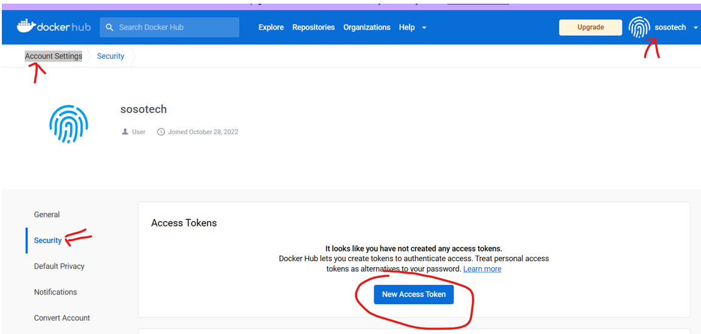

# Jenkins

## Setup
***NOTE:*** Don't Forget to update your inbound Security Group with TCP-port 8080
If you have any issues, then: curl the IP address if you had any issues.

```curl http://[your-put-IP]/latest/user-data LIKE SO: --> curl http://56.22.1.2/latest/user-data```
Also refer to site to update your code: [Optional-Link](https://www.jenkins.io/blog/2023/03/27/repository-signing-keys-changing/)

Ubuntu installation script

```sh
#!/bin/bash
sudo apt update
sudo apt install openjdk-11-jdk -y
sudo apt install maven -y
curl -fsSL https://pkg.jenkins.io/debian-stable/jenkins.io-2023.key | sudo tee \
  /usr/share/keyrings/jenkins-keyring.asc > /dev/null
echo deb [signed-by=/usr/share/keyrings/jenkins-keyring.asc] \
  https://pkg.jenkins.io/debian-stable binary/ | sudo tee \
  /etc/apt/sources.list.d/jenkins.list > /dev/null
sudo apt-get update
sudo apt-get install jenkins -y
```

***Check and start the jenkins service***

```
sudo systemctl status jenkins
sudo systemctl start jenkins
java -version
whereis git
```

***Get Jenkins Password***

```
sudo cat /var/lib/jenkins/secrets/initialAdminPassword
```

***INSTALL JDK8 and MAVEN***
In Server terminal, Install Maven and JDK8

```
sudo apt update
sudo apt install openjdk-8-jdk -y
```

***INSTALL MAVEN***
Go to the Maven site and get latest version: [Right-click and copy .tar link](https://maven.apache.org/download.cgi)


```
sudo su -
cd /opt
apt install wget
wget https://dlcdn.apache.org/maven/maven-3/3.9.1/binaries/apache-maven-3.9.1-bin.tar.gz
tar -xvzf apache-maven-3.9.1-bin.tar^C
mv apache-maven-3.9.1 maven
rm -rf apache-maven-3.9.1-bin.tar.gz 
```

***CD to ROOT and Copy the java path***
The path to add in Jenkins will be: ***/usr/lib/jvm/java-1.8.0-openjdk-amd64***. See below Photo

```
sudo su -
ls /usr/lib/jvm
```


***Configure [Git, Maven, JVM ]on Jenkins GUI***.
In the Jenkins UI --> manage Jenkins --> Global Tool Configuration [save]

JDK | Git | MAVEV


### Configure Credentials
Configure the following credentials
  - AWS
  - DockerHub --> (generate Token) My account --> security --> secret text
  - k8s Config
  - sonarqube --> (generate Token) My account --> security --> secret text


Navigate to: ***Jenkins UI --> manage Jenkins --> Manage Credentials --> System --> Global credentials***


#### configure Dockerhub
  1. Log into your dockerhub account and create a token in settings --> security: [LINK](https://hub.docker.com/settings/security)
  

  2. 

### Jenkins Jobs
Demo Jobs

#### Pipeline
 There are 2 Options to use here:
  1. Pipeline script
  2. Pipeline script from SCM

    Some Sample Pipeline Scripts: 

```sh
pipeline {
  agent any
  stages {
    stage('Welcome to sosotech') {
      steps {
        sh '''
          aws --version
        '''
      }
    }
  }
}
```

#### FreeStyle


# Docker