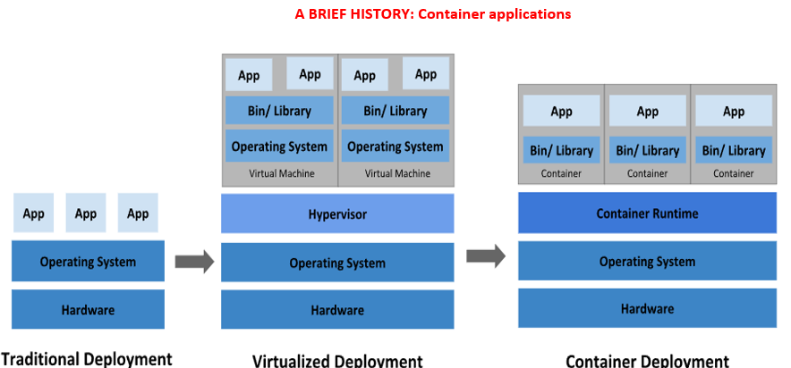
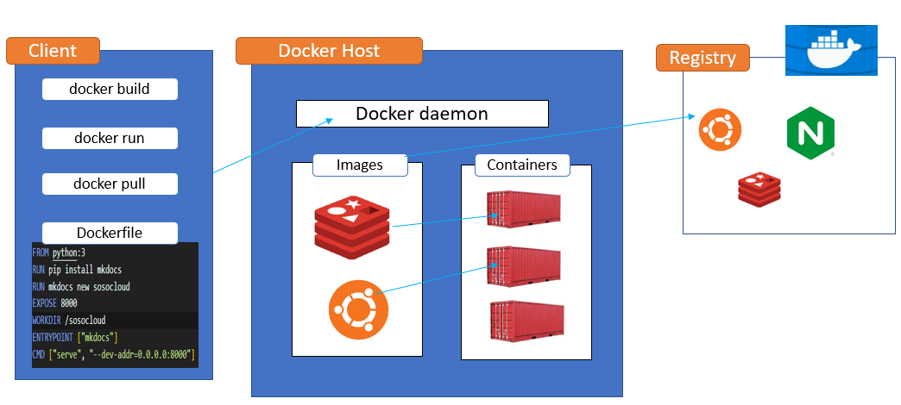

#  History of Containarizaion



- ***Traditional deployment era:*** Early on, organizations ran applications on physical servers. 
There was no way to define resource boundaries for applications in a physical server, and this 
caused resource allocation issues. For example, if multiple applications run on a physical server, 
there can be instances where one application would take up most of the resources, and as a result, 
the other applications would underperform. A solution for this would be to run each application on 
a different physical server. But this did not scale as resources were underutilized, and it was 
expensive for organizations to maintain many physical servers.
- ***Virtualized deployment era:*** As a solution, virtualization was introduced. It allows you to 
run multiple Virtual Machines (VMs) on a single physical server's CPU. Virtualization allows 
applications to be isolated between VMs and provides a level of security as the information of 
one application cannot be freely accessed by another application. Each VM is a full machine running
all the components, including its own operating system, on top of the virtualized hardware.
- ***Container deployment era:*** Containers are like VMs, but they have relaxed isolation properties 
to share the operating system (OS) the applications. Containers are an abstraction at the app layer 
that packages code and dependencies together. Multiple containers can run on the same machine and 
share the OS kernel with other containers, each running as isolated processes in user space.

### Docker architecture


Docker uses a client-server architecture. The Docker client talks to the Docker daemon, which does 
the heavy lifting of building, running, and distributing your Docker containers. The Docker client 
and daemon can run on the same system, or you can connect a Docker client to a remote Docker daemon. 
The Docker client and daemon communicate using a REST API, over UNIX sockets or a network interface.

***What is Docker?***
Docker is a software platform that allows you to build, test, and deploy applications quickly. 
Docker packages software into standardized units called containers that have everything the software 
needs to run including libraries, system tools, code, and runtime. Using Docker, you can quickly 
deploy and scale applications into any environment and know your code will run. 
***What’s a docker container?***
A container is a Runnable instance of an image. A Docker container image is a lightweight, 
standalone, executable package of software that includes everything needed to run an application: code, 
runtime, system tools, system libraries and settings.
***What is an image***
An image is a read-only template with instructions for creating a Docker container. Often, an image 
is based on another image, with some additional customization. For example, you may build an image which 
is based on the ubuntu image, but installs the Apache web server and your application, as well as the 
configuration details needed to make your application run.
***What’s the difference between an Image and a container?***
Simply put, containers are dependent on images. Containers need images to construct a run-time 
environment and run an application.

### Dockerfile
A Dockerfile is a text document that contains all the commands a user could call on the command line to 
assemble an image.

***Breaking down the components of a dockerfile***

```Dockerfile
FROM node
WORKDIR /app
COPY . /app 
RUN npm install 
EXPOSE 80
CMD ["node", "server.js"]
```

1. FROM node              
      build your image from another base image
4. WORKDIR /app             
      this workdir is what i defined in #2, I am telling Docker that when I install npm, I want you to do in this directory. 
      Optionally, i can still define my WORKDIR as " /app  "
2. COPY . /app             
     - COPY . ./ 
     - COPY . .
     - tell docker the files on the left it should use. In our case i'm using [. .] meaning select every file
     - The first [.] represent the files in the same directory as the dockerfile
     - The second [.] represents the path inside the image where those files will be stored.
     - Ex: you can copy like so: " COPY . /app " IN this example we are copying the files to /app in the container
     - I can also set as a relative path as just [ . ./] because I have defined a workdir with a defined value
3. RUN npm install            
     - if you recall, we did this process as a command earlier
6. EXPOSE 80               
     - remember we have defined a port # in our server.js, and we have to let docker know that 
     it should listen to this port
5. CMD ["node", "server.js"]         
     - to define a CMD, we open an array [], and also pass 2 strings "", "" to separate our commands
     - CMD command specifies the instruction that is to be executed when a Docker container starts.
     - We are telling docker to use the node command inside the container to run our server.js file.

### Docker Network
One of the reasons Docker containers and services are so powerful is that you can connect them 
together, or connect them to non-Docker workloads. 
Docker containers can communicate an HTTP request in ways:
-	From the container to an external application via an API communication or 
-	From the container to a local host machine
-	From the container to another container application

#### Docker Network Drivers
Docker Networks actually support different kinds of "Drivers" which influence the behavior of the Network.
The default driver is the "bridge" driver - it provides the behavior shown in this module (i.e. Containers 
can find each other by name if they are in the same Network).
The driver can be set when a Network is created, simply by adding the --driver option.

EX:	```docker network create --driver bridge soso-net```

Of course, if you want to use the "bridge" driver, you can simply omit the entire option since "bridge" 
is the default anyways. Docker also supports these alternative drivers - though you will use the "bridge" 
driver in most cases:
***host:*** For standalone containers, isolation between container and host system is removed 
(i.e. they share localhost as a network)
***overlay:*** Multiple Docker daemons (i.e. Docker running on different machines) are able to connect with each other. 
Only works in "Swarm" mode which is a dated / almost deprecated way of connecting multiple containers
***macvlan:*** You can set a custom MAC address to a container - this address can then be used for 
communication with that container
***none:*** All networking is disabled.
***Third-party plugins:*** You can install third-party plugins which then may add all kinds of behaviors and 
functionalities. As mentioned, the "bridge" driver makes most sense in the vast majority of scenarios.

#### Docker Storage 
There are 2 kinds of storage that docker can use (Anonymous Volume/named volume and Bind Mount)
***Anonymous Volume/named volume*** are managed by docker, while ***Bind Mount*** is managed by us, cause we setup
(Anonymous Volume): A type of volume managed by docker. Anonymous volumes have to be created inside a dockerfile.

Named Volume: For Data that can be viewed and stored but can’t be accessed directly
For Named volume, I don’t have to add the volume in the dockerfile. I will add a volume line in the command 
I will type in the terminal.

  Ex: Creating a sample Names Volume:

``` 
docker run -d -p 3000:80  --name mysoso-container sosonode    
docker run -d -p 3000:80  --name mysoso-container [-v for volume] [the path inside the container we wanna save] [volume name]
docker run -d -p 3000:80  --name mysoso-container -v sosofeedback:/app/feedback mysosofeedback-node:volumes
```

Ex: Creating a sample Bind Mounts Volume:

```
docker run -d -p 3000:80  --name mysoso-container -v sosofeedback:/app/feedback [add another volume] mysosofeedback-node:volumes 
docker run -d -p 3000:80  --name mysoso-container -v sosofeedback:/app/feedback -v  “/Users/macfe/OneDrive/Desktop/nodejs-a-z/nodejs-02/data-volume-dockerfile/data-volumes-02-added-dockerfile:/app” mysosofeedback-node:volumes 
```

### Use Cases  
#### 1. Docker and Mkdocs 
Build and deploy push Mkdocs to ECR/DockerHub
Clone this repo: [docs_docker_io](https://github.com/sosotechnologies/docs_docker_io.git)

***Install Docker***
```
sudo yum install docker -y
sudo systemctl status docker
sudo systemctl start docker
sudo systemctl enable docker
```
13. #### Build and Push Docker
```sudo docker build -t sosodocs .```

***Tag the sosodoc image***

```sudo docker tag sosodocs 088789840359.dkr.ecr.us-east-1.amazonaws.com/soso-repository:mkdocs-v1```

***Push image to repo***

```sudo docker push 088789840359.dkr.ecr.us-east-1.amazonaws.com/soso-repository:mkdocs-v1```

***Run the image with any one of the 2 commands, set yout ip:80***

```docker run -itd -p 80:80 --rm sosodocs```

```docker run -t -i -p 80:80 sosodocs```

And that is all, you should be able to navigate to http://127.0.0.1:80 and see the documentation website running.


***Optional BONUS!!!: DEPLOY TO AN EXISTING EKS CLUSTER***  

```
k expose deploy mkdocs --name=mkdocs-svc --port=80 --type=LoadBalancer --targetPort=80 --dry-run=client -o yaml > deploy.yaml
```

```
k expose deploy mkdocs --name=mkdocs-svc --port=80 --type=LoadBalancer --target-port=80 --dry-run=client -o yaml > service.yaml
```

***Optional***
Tag Your docker image with a version 

 ```sudo docker tag sosodocs sosodocs:v1```

Delete the existing running container, 26b43376e040 is mine, get yours.

```sudo docker rm 26b43376e040```    
           OR
```sudo docker rm 26b43376e040 --force```

Re-run the new versioned-image

 ```sudo docker run -itd -p 80:80 --rm sosodocs:v1```

To remove container or image:

```
docker rm [container]
docker rmi [image]
```