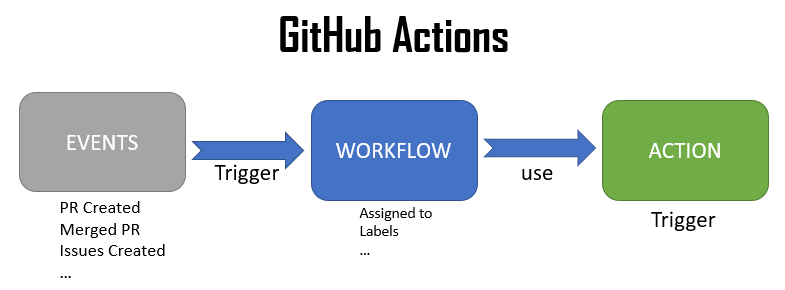

# Getting Started
GitHub Actions is a continuous integration and continuous delivery (CI/CD) platform that allows 
you to automate your build, test, and deployment pipeline. You can create workflows that build 
and test every pull request to your repository, or deploy merged pull requests to production.

Github actions has three main components: Events -> Workflows -> Actions
Workflow triggers are events that cause a workflow to run.  
Events provide status updates from GitHub repos from code commits or other event of a project.

  

For more information on workflows. [see site-link:](https://docs.github.com/en/actions/using-workflows)
For more information about how to use workflow triggers: See [workflow triggers](https://docs.github.com/en/actions/using-workflows/triggering-a-workflow)

## Description of the below yaml file
- name: is straightforward, you can name what ever name you choose
- The events is the line thet starts with On. In the yaml file, we have an event to push.
- actions/checkout@v3: is already defined in Github. You can see more Here: [github actions](https://github.com/orgs/actions/repositories)
- create a personal access token in your HitHub account and name: PERSONAL_TOKEN

```yml
name: Publish docs via GitHub Pages
on:
  push:
    branches:
      - main
permissions:
  contents: write

jobs:
  deploy:
    runs-on: ubuntu-latest
    steps:
      - uses: actions/checkout@v3
      - uses: actions/setup-python@v4
        with:
          python-version: 3.x
      - uses: actions/cache@v2
        with:
          key: ${{ github.ref }}
          path: .cache
      - run: pip install mkdocs-material 
      - run: mkdocs gh-deploy --force
        env:
          PERSONAL_TOKEN: ${{ secrets.PERSONAL_TOKEN }}
          CONFIG_FILE: folder/mkdocs.yml
          #GITHUB_TOKEN: ${{ secrets.GITHUB_TOKEN }}
          #GITHUB_TOKEN: ${{ secrets.GITHUB_TOKEN }}
```

.github/workflows

[mkdocs github actions](https://squidfunk.github.io/mkdocs-material/publishing-your-site/#material-for-mkdocs)

[managing-a-custom-domain](https://docs.github.com/en/pages/configuring-a-custom-domain-for-your-github-pages-site/managing-a-custom-domain-for-your-github-pages-site)

