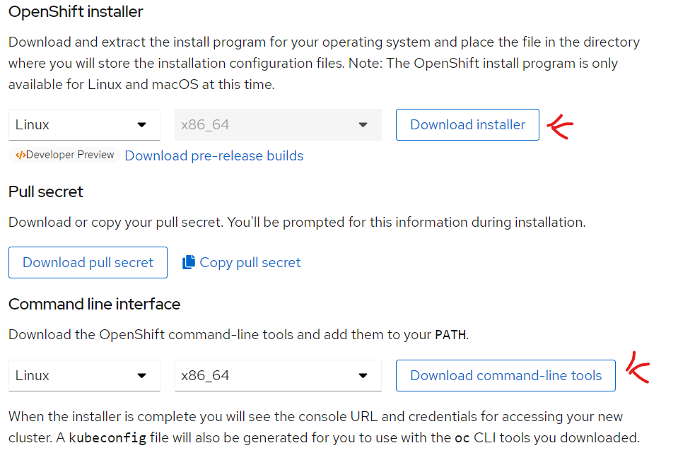
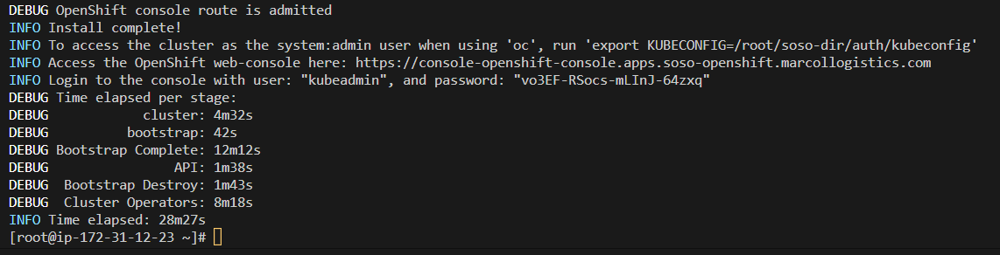

# What's Red Hat OpenShift
Red Hat OpenShift, the industry's leading hybrid cloud application platform powered by Kubernetes, 
brings together tested and trusted services to reduce the friction of developing, modernizing,
deploying, running, and managing applications. 
See official link: [Openshift](https://www.redhat.com/en/technologies/cloud-computing/openshift)

## Getting Started - Steps
- Signup/signin to Openshift account: [See-Link](https://cloud.redhat.com/openshift/install)
- Navigate to: Clusters -> Cluster Type -> Amazon Web Services -> Installer-provisioned infrastructure
   

### Install OpenShift on AWS
AWS Openshift installation Link: [See-Link](https://console.redhat.com/openshift/install/aws/installer-provisioned)
There are ***Two*** Cluster-Setup options to choose: a customized cluster ***or*** quickly install.

  - Install the Openshift installer and client on your local computer.
  - Move that file to your remote linux machine. You're see the client and installer.
  - Extract the installer and client: 

     ```tar xvf openshift-install-linux.tar.gz```
     ```tar xvf openshift-client-linux.tar.gz```

  - Move the oc, kubectl and installer to usr/bin directoory

    ```
    sudo mv oc /usr/local/bin/
    sudo mv kubectl /usr/local/bin/
    sudo cp openshift-install /usr/local/bin/
    which openshift-install
    oc help
    ```

  - Copy the secret content and paste in a file. This secret is from the redhad account, 
    used to Map the AWS Cluster with the redHat account.
  - ***In the AWS Console, setup the following:***
      - Route53 public Hoster Zone
      - Add OpenShift port 6443 to instance security groups
      - Create 
        - Create Access and Secret Keys for the Root-user and configure aws
          ```aws configure```

  - Create an SSH Key in the root directory

    ```[root@ip-172-31-12-23 ~]# ssh-keygen -t rsa -b 4096 -N '' -f id_rsa```

  - Evaluate and add to root

    ```
       [root@ip-172-31-12-23 ~]# eval "$(ssh-agent -s)"
    [root@ip-172-31-12-23 ~]# ssh-add /root/id_rsa
    ```
   - ***make*** a new directory for the installation, mine is soso-dir
   ```mkdir soso-dir/```
  
  - Now install Openshift
  ```./openshift-install create cluster --dir /root/soso-dir/ --log-level debug``` 

  After installation, you should have your results as seen in the below image:
  

  ***Cat and export the konfig file***
  
  ```
    cat soso-dir/auth/kubeconfig
    export KUBECONFIG=/root/soso-dir/auth/kubeconfig
    oc whoami
  ```
  ### Destroy the cluster
  ```./openshift-install destroy cluster --dir /root/soso-dir/ --log-level debug``` 


  ***OR OR OR OR OR***
  
  - ***install Openshift using the config, so you can customize***. 
    A prompt will begin. The last prompt will be the secret
    Copy and paste the secret characters that we had saved earlier.
      - ```openshift-install create install-config``` 

  - Copy the install-config.yaml to install-config.yaml.bak
      - ```cp install-config.yaml install-config.yaml.bak```
      - ```vi install-config.yaml.bak```

  - paste the below content in the file. edit the file to suite ur options.
```yaml
apiVersion: v1
baseDomain: marcollogistics.com
controlPlane:
  hyperthreading: Enabled
  name: master
  platform:
    aws:
      zones:
      - us-east-1a
      #- us-east-1b
      #- us-east-1c
      rootVolume:
        size: 100
        type: gp2
      type: m4.xlarge
  replicas: 3
compute:
- hyperthreading: Enabled
  name: worker
  platform:
    aws:
      zones:
      - us-east-1a
      #- us-east-1b
      #- us-east-1c
      rootVolume:
        size: 100
        type: gp2
      type: m4.xlarge
  replicas: 1
metadata:
  name: openshift
networking:
  clusterNetwork:
  - cidr: 10.128.0.0/14
    hostPrefix: 23
  machineNetwork:
  - cidr: 192.168.0.0/20
  networkType: OpenShiftSDN
  serviceNetwork:
  - 172.30.0.0/16
platform:
  aws:
    region: us-east-1
    userTags:
      adminContact: Collins
      costCenter: 123
      email: cafanwi@sosotechnologies.com
publish: External
pullSecret: ''
sshKey: 
```

 SEE MY workflow process

 ```
 [ec2-user@ip-172-31-12-23 s]$ ls
 openshift-install-linux.tar.gz  README.md
 [ec2-user@ip-172-31-12-23 s]$ tar xvf openshift-install-linux.tar.gz 
 README.md
 openshift-install
 [ec2-user@ip-172-31-12-23 s]$ ls
 openshift-install  openshift-install-linux.tar.gz  README.md
 [ec2-user@ip-172-31-12-23 s]$ ls
 openshift-client-linux.tar.gz  openshift-install  openshift-install-linux.tar.gz  README.md
 [ec2-user@ip-172-31-12-23 s]$ tar xvf openshift-client-linux.tar.gz 
 README.md
 oc
 kubectl
 [ec2-user@ip-172-31-12-23 s]$ ls
 kubectl  oc  openshift-client-linux.tar.gz  openshift-install  openshift-install-linux.tar.gz  README.md
 [ec2-user@ip-172-31-12-23 s]$ 
```

AWS Openshift installation Link: [See-Link](https://docs.openshift.com/container-platform/4.1/installing/installing_aws/installing-aws-account.html)


