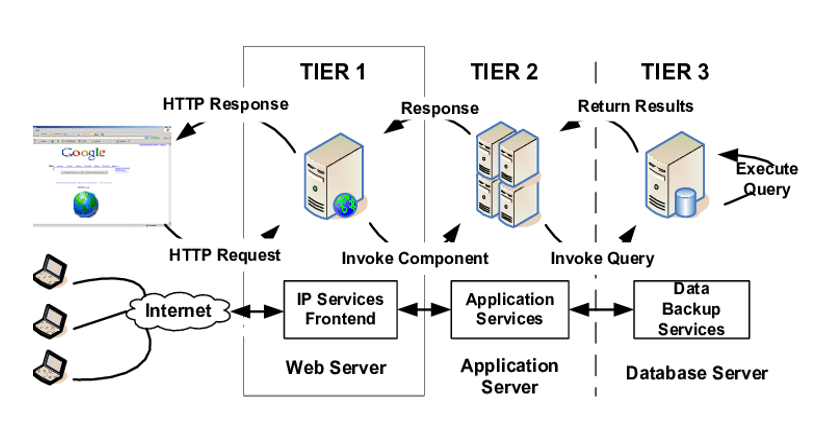
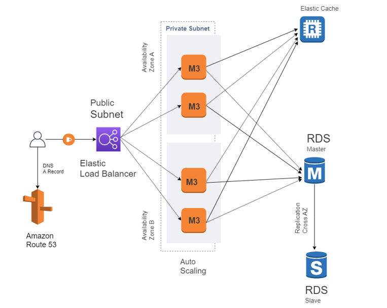

# What is a 3 tier Application?
A 3-tier application will compose of 3 layers: a Presentation tier, an Application tier, and a Data tier.

## Benefits of a 3 tier Application?
The benefits of using a 3-tier architecture include improved horizontal scalability, 
performance, and availability. With three tiers, each part can be developed concurrently 
by a different team of programmers coding in different languages from the other tier developers. 
Because the programming for a tier can be changed or relocated without affecting the other 
tiers, the 3-tier model makes it easier for an enterprise or software packager to continually 
evolve an application as new needs and opportunities arise. Existing applications or critical 
parts can be permanently or temporarily retained and encapsulated within the new tier of 
which it becomes a component.

### The 3 different layers explained
An example 3 tier application will compose of 3 layers: 
a Presentation tier, an application tier, and a Data tier. 

***The Presentation tier*** is a graphical user interface (GUI) that communicates with 
the other two tiers…in this layer, the users can directly access the web page, or an operating 
system's GUI. The is written in languages like built with HTML5, cascading style sheets (CSS) 
and JavaScript, and the presentation tier communicates with the other tiers through application 
program interface (API) calls.

***Application tier*** also known as the business logic tier… controls how the application 
functions. The application layer is written in a programming language such as Java and contains 
the business logic that supports the application's core functions. The underlying application 
tier can either be hosted on distributed servers in the cloud or on a dedicated in-house server, 
depending on how much processing power the application requires. 

***Data tier*** contains the database servers, file shares, and anything that will be 
saved in the database... it can be hosted on-prem or in the cloud. Popular database 
systems for managing read/write access include MySQL, PostgreSQL, Microsoft 
  
  

  Sample AWS 3-Tier Application
   

  ***The Presentation tier***
    1.	A Public Route Table — associated with 2 Public Subnets (1/AZ)
    2.  At least 2 EC2 instances with a boot strapped Static Web Page — managed by an Auto Scaling Group
    3.  EC2 Web Server Security Group

  ***The Application tier*** 
    1.	A Private Route Table — associated with 2 Private Subnets (1/AZ)
    2.	At least 2 EC2 instances managed by an Auto Scaling Group
    3.	EC2 Application Server Security Group

  ***The Data tier***
    1.	A Private Route Table — associated with 2 Private Subnets (1/AZ)
    2.	A Database Security Group
    3.	A free Tier MySQL RDS Database
