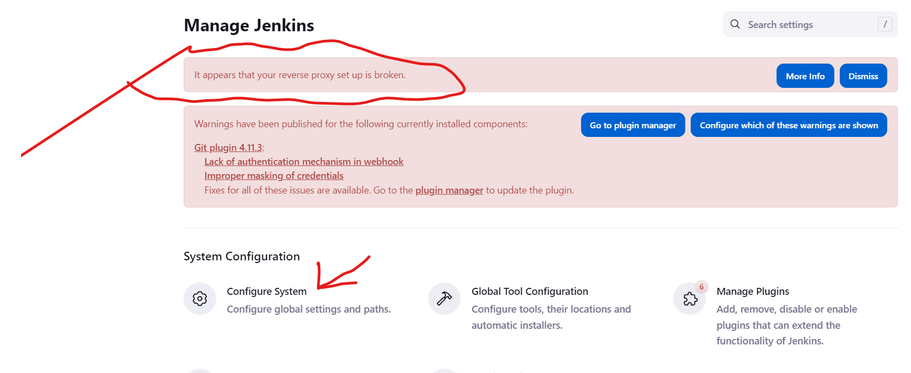
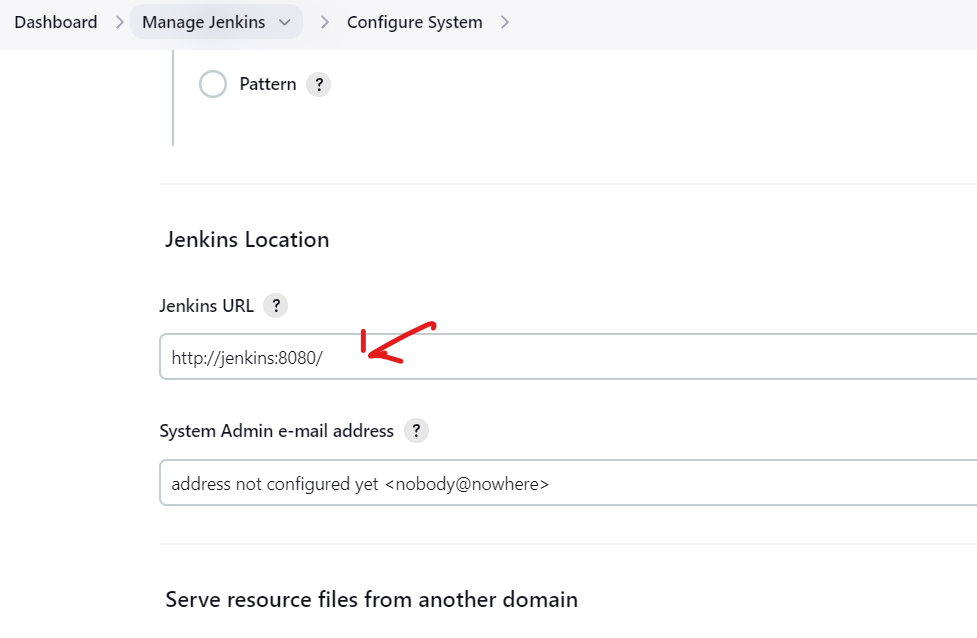
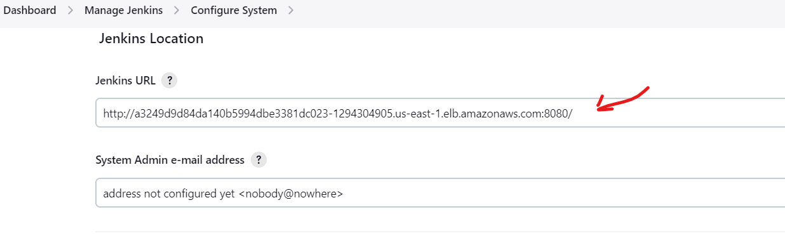

# What are we going to achieve here?
See the official terraform repo install terraform: [Link]()

## Jenkins EKS LoadBalancer Reverse Proxy
If you see this: 'It appears that your reverse proxy setup is broken',
Follow the 3 image steps to resolve:

see the issue




apply changes



### Use IaC(terraform) 

## Deploy sample application with Helm

```
Case study: bitnami Example chart 
$ helm repo list           //to list the repos
$ helm repo add collins-bitnami https://charts.bitnami.com/bitnami     //add the bitnami chart and name the chart
$ helm repo list           //to list the repos
$ helm search repo mysql                    // Search for charts within the Bitnami repository
$ helm install mydb collins-bitnami/mysql
$ helm repo remove bitnami   //to remove the chart
```

```
Case study: Nginx Example chart 
$ helm repo add nginx-stable https://helm.nginx.com/stable 
$ helm repo update 
followed by: 
$ helm install nginxingress nginx-stable/nginx-ingress 
$ helm install ---name nginxingress nginx-stable/nginx-ingress
```