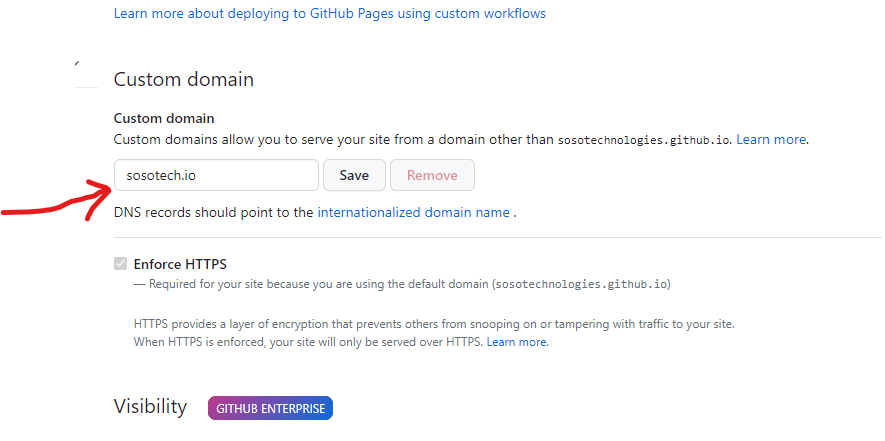
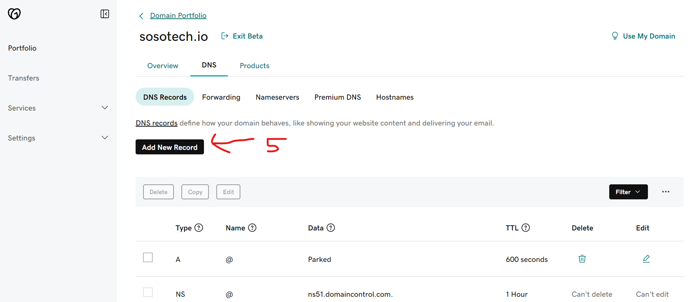
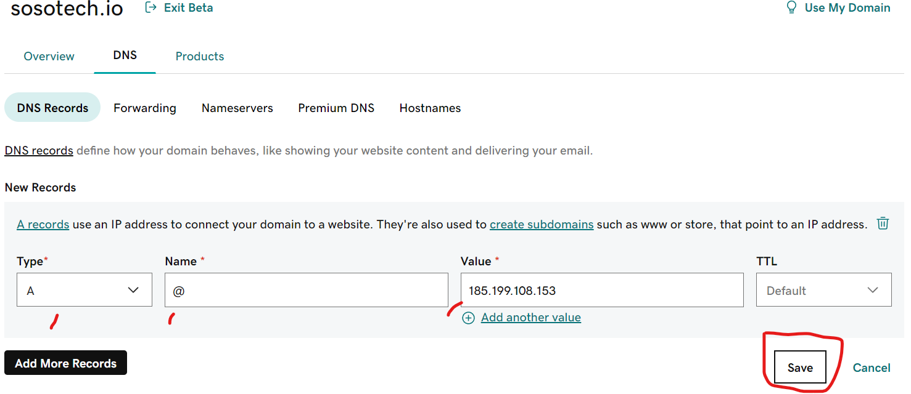
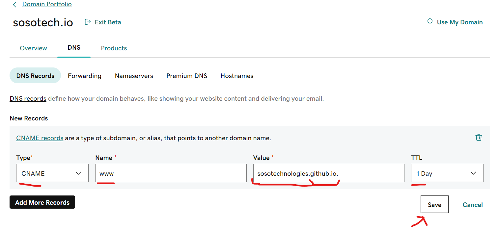
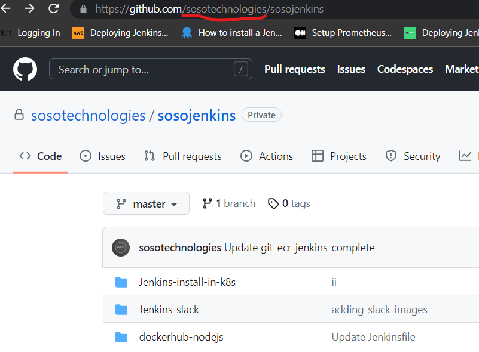
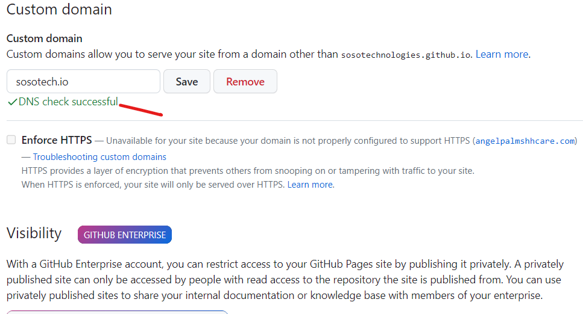

# GITHUB custom Domain with GOdaddy
- Deploy your site and go to settings --> pages
- Go to GoDaddy site, purchase and click on domain u wanna use and configure.
- Go to ths GitHub-doc: [To create A records, point your apex domain to the IP addresses for GitHub Pages-Link](https://docs.github.com/en/pages/configuring-a-custom-domain-for-your-github-pages-site/managing-a-custom-domain-for-your-github-pages-site#configuring-an-apex-domain) 

## Add the Domain to GitHub pages
In GitHub, go to settings --> pages and add the Custom domain


## configure an APEX domain
Copy the IP'S and create ***individual*** records for all the IP's
As og 04/2023, these are the 4 IP's:


```
185.199.108.153
185.199.109.153
185.199.110.153
185.199.111.153 
```

***Save the 4 A-RECORDS each as seen in my example of the 1'st IP***



***Save 1 CNAME-RECORD as seen in my example***


Get the value that will be added in the Godaddy value section from ur github url:



Go now and recheck the domain in GitHub pages and all should be good now.



