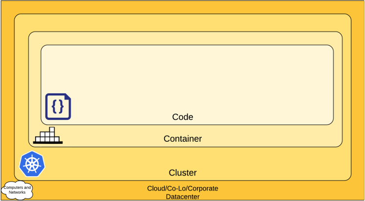

# Controlling Access to the Kubernetes API
Users access the Kubernetes API using kubectl, client libraries, or by making 
REST requests. Both human users and Kubernetes service accounts can be authorized 
for API access. When a request reaches the API, it goes through several stages, 
illustrated in the following diagram:

  

## Steps:
A request is sent through an API serves on port 443, protected by TLS. 
The API server presents a certificate. This certificate may be signed using a private 
ertificate authority (CA), or based on a public key infrastructure linked to a 
generally recognized CA.

***STEP 1: Authentication:***

Once TLS is established, the HTTP request moves to the Authentication step. Authentication modules include client certificates, password, and plain tokens, bootstrap tokens, and JSON Web Tokens (used for service accounts). 
Multiple authentication modules can be specified, in which case each one is tried in sequence, until one of them succeeds.
If the request cannot be authenticated, it is rejected with HTTP status code 401. Otherwise, the user is authenticated as a specific username, and the username is available to subsequent steps to use in their decisions. Some authenticators also provide the group memberships of the user, while other authenticators do not.
For more information about the different ways to Authenticate, check this url:
[See link](https://kubernetes.io/docs/reference/access-authn-authz/authentication/)

***STEP 2: Authorization***
So, after the request has been authenticated to be coming from a specific user, the request must next be authorized. A request MUST include:
  -	the username of the requester
  -	the requested action, and 
  -	the object affected by the action.

Kubernetes supports multiple authorization modules, such as ABAC mode, RBAC Mode, and Webhook mode. When an administrator creates a cluster, they configure the authorization modules that should be used in the API server. If more than one authorization modules are configured, Kubernetes checks each module, and if any module authorizes the request, then the request can proceed. If all of the modules deny the request, then the request is denied (HTTP status code 403).
See the below sample request:
For more information about Authorization: [check this url](https://kubernetes.io/docs/reference/access-authn-authz/authorization/)

***STEP 3: Admission control***
Admission Control modules are software modules that can modify or reject requests. They act on requests that create, modify, delete, or connect to (proxy) an object. 
Note: if any admission controller module rejects, then the request is immediately rejected. When multiple admission controllers are configured, they are called in order.

***STEP 4: Validation***
Once a request passes all admission controllers, it is validated using the validation routines for the corresponding API object, and then written to the object store.
For more information about Admission control, check this url:
For more information: [check this url](https://kubernetes.io/docs/reference/access-authn-authz/admission-controllers/)

## OpenSSL 
Setup steps:

```
# Generate a ca.key with 2048bit
$ openssl genrsa -out ca.key 2048
# According to the ca.key generate a ca.crt (use -days to set the certificate effective time):
$ openssl req -x509 -new -nodes -key ca.key -subj "/CN=${MASTER_IP}" -days 10000 -out ca.crt
# Generate a server.key with 2048bit:
$ openssl genrsa -out server.key 2048

# Generate the certificate signing request based on the config file:
$ openssl req -new -key server.key -out server.csr -config csr.conf
# Generate the server certificate using the ca.key, ca.crt and server.csr:
$ openssl x509 -req -in server.csr -CA ca.crt -CAkey ca.key \
    -CAcreateserial -out server.crt -days 10000 \
    -extensions v3_ext -extfile csr.conf

# View the certificate signing request:
$ openssl req  -noout -text -in ./server.csr

# View the certificate:
$ openssl x509  -noout -text -in ./server.crt
```

## Cloud Native Security
The 4C’s of cloud Native Security
 

1. ***Cloud:*** 
Each cloud provider makes security recommendations for running 
workloads securely in their environment. If you are running a Kubernetes cluster 
on your own hardware or a different cloud provider, consult your documentation 
for security best practices. For example, if you are running an EKS cluster 
you should understand Amazon Web Services	
Checkout the security rules: [Common security Rules](https://aws.amazon.com/security/) 

2. ***Cluster:*** When dealing with cluster security, there are two areas of 
concern for securing Kubernetes: 
  1.1.	Securing the cluster components that are configurable
  1.2.	Securing the Components in the cluster (Your applications)
  1.1.	Securing the cluster 
        For more info: [Click-link](https://kubernetes.io/docs/tasks/administer-cluster/securing-a-cluster/)
  1.2.	Securing the applications 
        When it comes to securing the applications running n the cluster, the key question here is: 
        how to secure the entire chain of applications in the cluster? For example: If you are 
        running a service (Service Y) that is critical in a chain of other resources and a 
        separate workload (Service Z) which is vulnerable to a resource exhaustion attack, 
        then the risk of compromising Service Y is high if you do not limit the 
        resources of Service Z. 
The Recommended security Areas for your application workloads

To manage application security at the cluster level, a deep understanding of the 
following key concepts is required:

  -	RBAC Authorization (Access to the Kubernetes API) 
  - Authentication 
  - Application secrets management (and encrypting them in etcd at rest)
  - Pod Security
  - Quality of Service (and Cluster resource management)
  - Network Policies 
  - TLS for Kubernetes Ingress

 ***RBAC Authorization:*** Role-based access control (RBAC) is a method of regulating access 
 to computer or network resources based on the roles of individual users within your 
 organization. The RBAC API declares four kinds of Kubernetes object: Role, ClusterRole, 
 RoleBinding and ClusterRoleBinding.

   ***Role:*** Role contains rules that represent a set of permissions. Role is namespace 
    specific, which means that a Role always sets permissions within a particular namespace.

   ***ClusterRole:*** clusterrole is used to define permissions on namespaced resources
     and be granted access within individual namespace(s). It’s not namespace specific and 
     can define permissions on cluster-scoped resources.

3. ***Container:***
Container Security is a critical part of a comprehensive security assessment.

For more on Container Security, read [VMware Container Security](https://www.vmware.com/topics/glossary/content/container-security.html#:~:text=Container%20Security%20is%20a%20critical,of%20security%20tools%20and%20policies.)

4. ***Code:***

Some Coding Language Paradigms are comprise a variety of styles.
 styles are imperative, functional, logical, and object-oriented languages. Programmers 
 can choose from these coding language paradigms to best-serve their needs for a specific project.

 The following are examples of each paradigm.

  - Object-Oriented: Python, Java, C++, 
  - Imperative or Procedural: Cobol, Fortran, C
  - Functional: Clojure Scala, 
  - Logical: Prolog, SQL
  
Cloud code security focuses on code with several use cases, including infrastructure as code (IaC) 
security, application code security and software supply chain security.

  ***IaC Security:***
  The key to a successful code security strategy for IaC is ensuring security is embedded 
  directly in developer tools and workflows. By surfacing actionable feedback in code and 
  embedding security guardrails in the build pipeline, IaC security empowers developers to 
  ship infrastructure that’s secure by default.

  ***Application Code Security:***
  A strong code security strategy relies on secure coding best practices and code reviews 
  to identify vulnerabilities. Through automated testing with technologies such as static 
  application security testing (SAST) for custom code and software composition analysis (SCA) 
  for open source code, code security solutions complement cloud workload protection by 
  identifying CVEs as early as possible.

  ***Software Supply Chain Security***
  Software supply chains comprise application and infrastructure components as well as 
  the underlying pipelines, including version control systems (VCS), continuous integration 
  and continuous deployment (CI/CD) pipelines, and registries. 
  Software supply chain security is an important part of a strong code security strategy, 
  as is understanding the connections between pipelines and infrastructure and application 
  code across the development lifecycle. 


