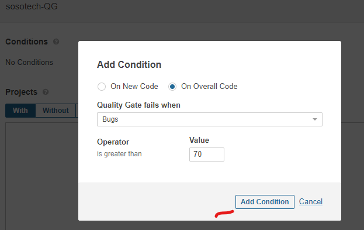
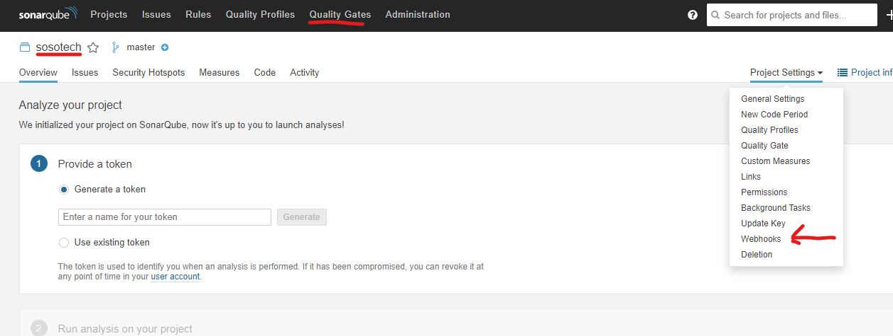
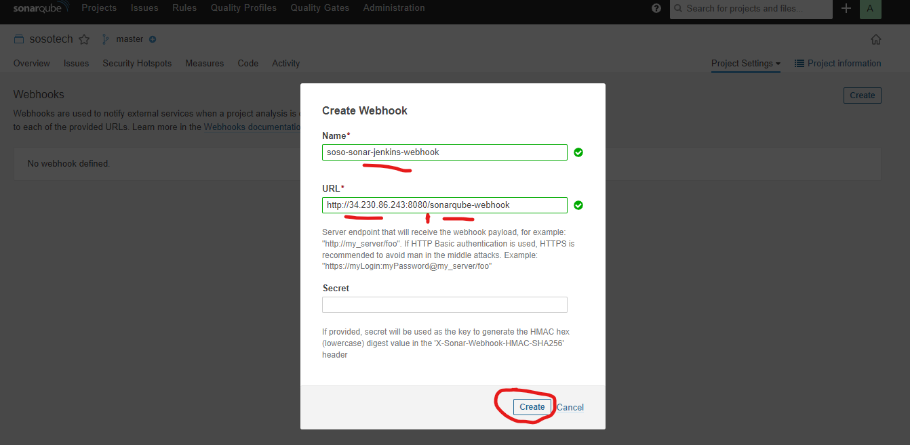
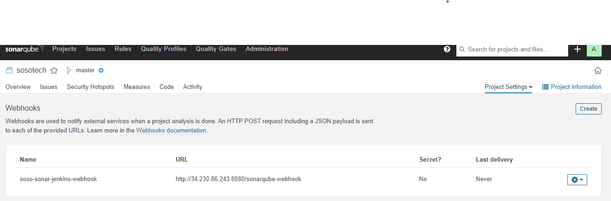

Wheck Style analysis
Quality Check, Gate

https://docs.sonarqube.org/latest/analyzing-source-code/scanners/jenkins-extension-sonarqube/
https://docs.sonarqube.org/latest/analyzing-source-code/scanners/sonarscanner/

### Create project
- Create a new project called: sosotech
- Generate a token called: sosotech-token   847ff2f312def534eb71b3a81750227f96673c24

### Quality gate
Create a New Quality gate

Add conditions

Next: Add the quality gate to the sonarqube project
Go To: Projects --> Quality Gate --> Projects Setting --> webhooks

Create a webhook called: ***soso-sonar-jenkins-webhook***. you can name watever you choose
- The webhook url is my jenkins url and the name - sonarqube-webhook like so [http://34.230.86.243:8080/sonarqube-webhook](http://34.230.86.243:8080/sonarqube-webhook)

