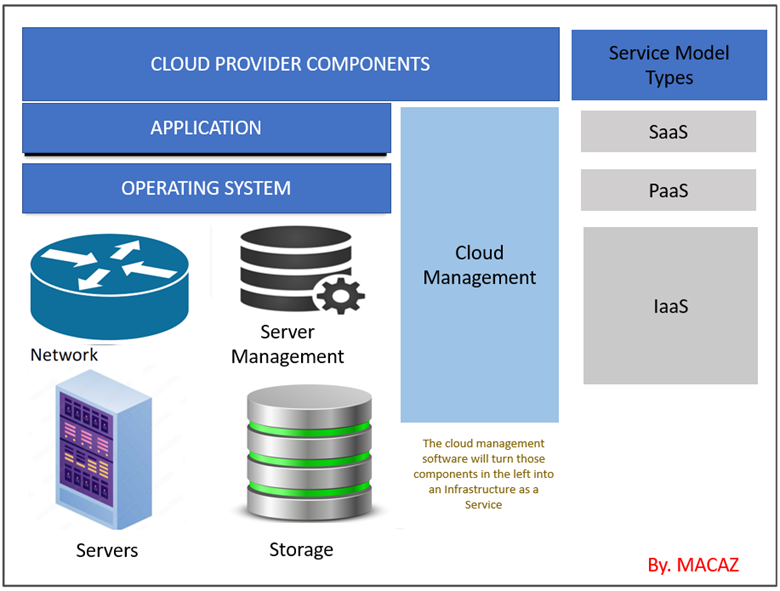
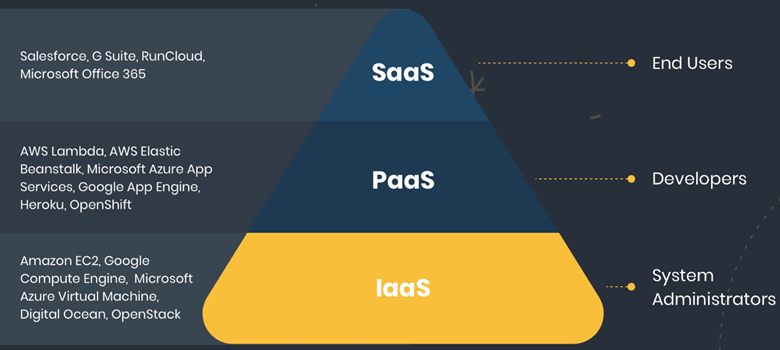

# Cloud Technologies
  -	Defining cloud computing
  - Defining private, public, and hybrid cloud
	- Exploring the components of cloud infrastructure
	- Defining the different Service Models

## What is Cloud Computing? 
Cloud computing is the use of hosted services, such as servers, data storage, databases, software, and networking over the internet¬ — instead of directly accessing your computer hard drive.
### Types of cloud computing
Cloud computing is offered in 3 major forms: private, public, and hybrid cloud.

- Private Cloud: 
  The private cloud computing service is a cloud computing model
  where the infrastructure is dedicated only to select users instead
  of the general public, either over the Internet or a private internal
  network. Other names for the private cloud are internal or corporate cloud.
  Some private cloud providers are VMware-vRealize Suite Cloud Management 
  Platform, AWS-Virtual Private Cloud, Microsoft-Azure Private Cloud…
- Public Cloud: 
  The public cloud is defined as computing services offered by third-party
  providers over the public Internet, making them available to anyone who 
  wants to use or purchase them. They may be free or sold on-demand, allowing 
  customers to pay only per usage for the CPU cycles, storage, or bandwidth they 
  consume. Some public cloud services are AWS, GCP, Azure, IBM Cloud, Alibaba Cloud…
- Hybrid Cloud:
  A hybrid cloud is a computing environment that combines an on-premises data center 
  (also called a private cloud) with a public cloud, allowing data and applications 
  to be shared between them. Some public cloud providers are VMware, Microsoft Azure…

### Components of cloud infrastructure

 - ***Client-side Infrastructure:*** 
   Here, users interact with the cloud through a front-end GUI
   (Graphical User Interface). Desktop, laptops, mobiles, tablets, and
   others are used on the client-side to access services.
 - ***Application:***
   The application may be any software or platform that a client wants to access.
 - ***The operating system:*** 
   The cloud operating system manages the operation, the virtual servers, 
   execution and processes of virtual machines and virtual infrastructure, as well 
   as the back-end hardware and software resources. 
 - ***Service:***
   Cloud Services are offered in different models. These services are being provided 
   based on the client’s request.

   Some of the service models are seen below

### Service Models
Cloud-Computing providers offer their “services” according to different models, of 
which the three standard models per NIST are Infrastructure as a Service (IaaS), 
Platform as a Service (PaaS), and Software as a Service (SaaS).

 - ***IAAS:*** 
   Infrastructure As A Service (IAAS) is means of delivering computing infrastructure
   as on-demand services. It is one of the three fundamental cloud service model 
   servers’ storage network operating systems. In the user purchasing servers, 
   software data center space, or network equipment and renting those resources 
   as a fully outsourced service can demand model. It allows dynamic scaling, and 
   the resources are distributed as a service. It generally includes multiple users 
   on a single piece of hardware.
 - ***PAAS:***
   Platform as A Service (PAAS) is a cloud delivery model for applications composed 
   of services managed by a third party. It provides elastic scaling of your application 
   which allows developers to build applications and services over the internet and the 
   deployment models include public, private and hybrid.
 - ***SAAS:*** 
   Software As A Service (SAAS) allows users to run existing online applications and 
   it is a model software that is deployed as a hosting service and is accessed over 
   Output Rephrased/Re-written Text the internet or software delivery model during 
   which software and its associated data are hosted centrally and accessed using their 
   client, usually an online browser over the web. SAAS services are used for the 
   development and deployment of modern applications.
  
   The emergence of Cloud computing has given rise to more as-a-service offerings. 
   Some of them include:

     - AIaaS: AI as a service
     - DaaS: Desktop as a service
     - ITaaS: IT as a service
     - RaaS: Ransomware as a service.

### Top benefits of cloud computing  

 
  - High Speed: the ability to spin up new instances in a matter of seconds.
  - Efficiency and Cost Reduction
  - Provides efficient Data Security
  - Scalable: ease with quickly — scale up/down infrastructures.
  - Collaboration: Cloud environments enable better collaboration across teams.
  - Provides unlimited Storage Capacity.
  - Provides ease in Back-up and Restoring of Data
  - Reliability: Cloud computing makes data backup, disaster recovery, and 
    business continuity easier and less expensive because data can be mirrored 
    at multiple redundant sites on the cloud provider’s network.

## FOCUS: AWS CLOUD

  ***What Is Amazon Web Services(AWS):*** 
   Amazon Web Services(AWS) is Amazon’s cloud computing platform that 
   offers a mix of packaged platform as a service (PaaS), software as 
   a service (SaaS), and infrastructure as a service (IaaS).  

  ### EC2
  Amazon EC2 is AWS primary web service that provides resizable compute 
  capacity in the cloud. 
   
   ***Instance types:***
    Amazon EC2 provides a wide selection of instance types optimized to fit 
    different use cases. Instance types comprise varying combinations of CPU, 
    memory, storage, and networking capacity and give you the flexibility to 
    choose the appropriate mix of resources for your applications. Each 
    instance type includes one or more instance sizes, allowing you to scale 
    your resources to the requirements of your target workload.

   ***Example instance Family:***
  
  - c4 Compute optimized—For workloads requiring significant processing
  - r3 Memory optimized—For memory-intensive workloads
  - i2 Storage optimized—For workloads requiring high amounts of fast SSD storage
  - g2 GPU-based instances—Intended for graphics and general-purpose GPU compute workloads

    ***Amazon Machine Images (AMIs):***
   Defines the initial software that will be on an instance when it is launched. 
   An AMI defines; The Operating System (OS) and its configuration, The initial 
   state of any patches, Application or system software. 
   AMI’s can be AWS published, from the AWS Marketplace, Generated 
   from Existing Instances, or Uploaded Virtual Servers

    ***Security Groups:***
   This is a VPC concept. If an instance is running in an Amazon VPC, 
   you can change which security groups are associated with an instance 
   while the instance is running.

    ***EBS:*** Is type of “block storage” volume offering by AWS. 
    EBS provides persistent block-level storage volumes for use with 
    Amazon EC2 instances. 
  
    ***Instance Stores:*** Is another type of “block storage” volume offering 
    by AWS for your instance. This storage is located on disks that are 
    physically attached to the host computer.

  ### S3
   Amazon Simple Storage Service is a secure, durable, and highly-scalable 
   cloud storage. Some use cases for cloud storage include: 

     - Backup and archive for on-premises or cloud data.
     - Content, media, and software storage and distribution.
     - Big data analytics.
     - Static website hosting.
     - Cloud-native mobile and Internet application hosting.

  ### VPC
   The Amazon Virtual Private Cloud (Amazon VPC) is a custom-defined 
   virtual network within the AWS Cloud.

    

   ***VPC COMPONENTS:***
   An Amazon VPC consists of the following main components: Subnets, 
   Route tables, Dynamic Host Configuration Protocol (DHCP) option sets 
   Security groups, Network Access Control Lists (ACLs).
   Also, optional components: Internet Gateways (IGWs), Elastic IP (EIP) 
   addresses, Elastic Network Interfaces (ENIs), Endpoints, Peering, 
   Network Address Translation (NATs) instances and NAT gateways, Virtual 
   Private Gateway (VPG), Customer Gateways (CGWs), 
   and Virtual Private Networks (VPNs)

    ***Subnets:*** 
   A subnet is a segment of an Amazon VPC’s IP address range. 
   Subnets reside within one Availability Zone and cannot span zones; 
   You can, however, have multiple subnets in one Availability Zone. 
   Each subnet must be associated with a route table, which controls 
   the routing for the subnet.

    ***Route Tables:*** 
   A route table is a logical construct within an 
   Amazon VPC that contains a set of rules (called routes) that are 
   applied to the subnet and used to determine where network traffic is 
   directed.

    ***Internet Gateways:*** 
   IGW allows communication between instances in your Amazon VPC 
   and the Internet. 
    
    ***Dynamic Host Configuration*** 
   Protocol (DHCP) Option Sets: provides a standard for passing 
   configuration information to hosts on a TCP/IP network. AWS 
   automatically creates and associates a DHCP option set for your 
   Amazon VPC upon creation and sets two options: domain-name-servers 
   (defaulted to AmazonProvidedDNS) and domain-name 
   (defaulted to the domain name for your region).

  ### IAM
   With AWS IAM Identity Center (successor to AWS Single Sign-On), 
   you can manage sign-in security for your workforce identities, also 
   known as workforce users. IAM Identity Center provides one place where 
   you can create or connect workforce users and centrally manage their 
   access across all their AWS accounts and applications. 

   For more on IAM chack the link: [IAM](https://docs.aws.amazon.com/singlesignon/latest/userguide/getting-started.html)

  ### AWS ELASTIC LOAD BALANCER (ELB)
   AWS has an Elastic Load Balancer that is used to distribute 
   incoming traffic across multiple targets, such as EC2 instances, 
   containers, and IP addresses, in one or more Availability Zones. 
   It monitors the health of its registered targets, and routes traffic 
   only to the healthy targets. Elastic Load Balancing supports routing 
   and load balancing of Hypertext.
   Transfer Protocol (HTTP), Hypertext Transfer Protocol Secure (HTTPS), 
   Transmission Control Protocol (TCP), and Secure Sockets Layer (SSL) 
   traffic to Amazon EC2 instances. 
    
   ***Types of AWS ELB:***
    

    The two major Elastic load balancers are: 

    ***Application Load Balancer*** 
     Application layer that describes the use of HTTP and HTTPS connections 
     from clients to the load balancer and from the load balancer to your 
     back-end instance. 
     
     ***Network Load Balancer***
     Are used to route traffic through layer 4, based IPs and TCP or UDP ports.

  ### EKS
   Amazon Elastic Kubernetes Service (Amazon EKS) is a managed service 
   that you can use to run Kubernetes on AWS without needing to install, 
   operate, and maintain your own Kubernetes control plane or nodes. 
   Kubernetes is an open-source system for automating the deployment, 
   scaling, and management of containerized applications.
   For more on EKS chack the link: [EKS]https://docs.aws.amazon.com/eks/latest/userguide/what-is-eks.html
