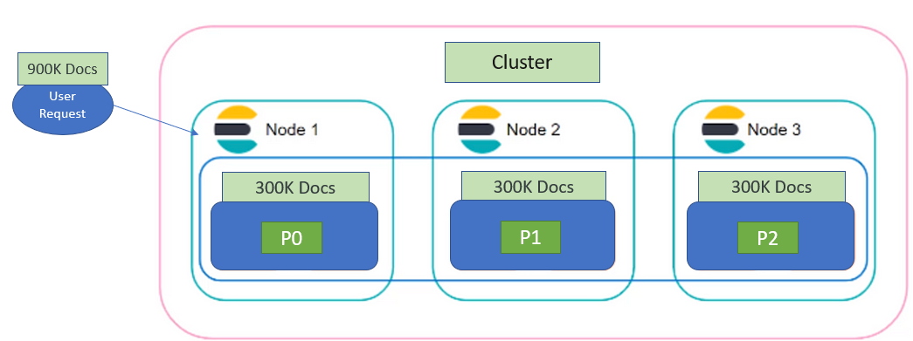

# ELK - Elastic Stack

ELK Stack is the world’s most popular log management platform.
The ELK stack is an acronym used to describe a stack that comprises 
of three popular projects: Elasticsearch, Logstash, and Kibana. 

 - ***Elasticsearch***
   is a distributed search and analytics engine built on Apache Lucene

 - ***Logstash***
   is used for both shipping as well as processing and storing logs

 - ***Kibana***
   is a visualization tool which is hosted through Nginx or Apache

 ***Some popular Use Cases for ELK are:***

Logging, Matrics, Security Analysis, Business Analysis
 -  Logging - logging and analysing Data, like gaming data
 -  Matrics - like NASA Rover can sent telematrics, sensor data
 -  Security Analysis - Helps with securing comunication in Apps like Slack
 -  Business Analysis - Helps with matching people

## ElasticSearch

With ElasticSearch, User can sends search quary to your website and your 
server send those requests to ElasticSearch, Elasticsearch then processes 
this request and Responds back to the user, through the Server.

### Elasticsearch Architecture: Key Components
 
***Elasticsearch Cluster***
 is composed of a group of nodes that store data.

***Elasticsearch Node***
 is an instance that runs in a cluster. Multiple nodes can be run on a 
 single machine. When Elastic is running, you will have an instance of 
 elastic known as Node. Each Node Has a unique ID and a node. Each Node 
 belongs to a single cluster. Data is stored as documents in Elasticsearch.
 Indices are used to group documents that are related to each other. 
 When an Index is created, it comes with a Shard, by default. 
 There are the three main options to configure an Elasticsearch node:

  - Elasticsearch master node
  - Elasticsearch data node
  - Elasticsearch client node

  ***Search movement*** - client --> servers --> ElasticSearch

 

  ***Shards***
  is where data is stored. What you create an Index, you can create multiple 
  shards that are distributed across nodes. Each shard has its replica to 
  recover data in case of node failure. The primary shard and replica shard is 
  always placed on different nodes. Horizontal scaling or scale-out is the main 
  reason to shard a database. The number of shards depends heavily on the 
  amount of data we have.

  ***Shard Example use Case 1***
   

   - A BCBSNC Elastic engineer has 900k documents that they want to store. 

   - Each Shard can only Hold a maximum of 300k Documents

   - Two more shards of 300GB each will be added bringing the total storage 
     capacity to 900K Documents


  ***Shard Example use Case 2***
   

   
   ***Scenario 1:***

   - An Elastic engineer searches 500k documents that is stored in a single Shard 
   - The response time for searching 500k Documents in a single shard is 10 seconds.
  

   ***Scenario 2:***
   
   - An Elastic engineer runs a parallel searches of 500k documents that are 
     distributed in 5 Shard.

   - The response time for searching 100k  Documents/Shard will be 2 seconds.

   - So, the response time for searching all 500k Documents that are distributed 
     amongst the 5 shard will still be 2 seconds.


 
### Kibana

 Kibana is a data visualization and exploration tool used for log and time-series 
 analytics, application monitoring, and operational intelligence use cases. 
 It offers powerful and easy-to-use features such as histograms, line graphs, 
 pie charts, heat maps, and built-in geospatial support.

  

   ***Kibana Aggregations***

   There are two main types of aggregations 
   
   1. ***Metric aggregations***  
     are used to calculate a value for each bucket based on the 
     documents inside the bucket.

   2. ***Bucket aggregations***
     are used groups documents together in one bucket according to your logic 
     and requirements, while the Metric aggregations 

  
  
   For More information on Kibana,: [Click link](https://logz.io/blog/kibana-tutorial-2/#kibanaaggregations)

### Adding data into Elasticsearch
The main consideration for indexing or adding data into Elasticsearch largely depends on 
whether you are indexing general content or timestamped data.

***General content:***
Index content like HTML pages, catalogs and other files. Send data directly to Elasticseach 
from your application using an Elastic language client. Otherwise use Workplace Search 
content connectors or the Enterprise Search web crawler.

***Timestamped data:***
The preferred way to index timestamped data is to use Elastic Agent. Elastic Agent is a single, 
unified way to add monitoring for logs, metrics, and other types of data to a host.

### How to ingest data into Elasticsearch Service
There are 4 main ways in Adding Data to ElasticSearch Service:

- By using Beats and Logstash

- By using Kibana

- By programmatically indexing data 

- Manually adding data

Read more about data ingestion in ElasticSearch [Click Link](https://www.elastic.co/blog/how-to-ingest-data-into-elasticsearch-service)

### The index
The index is the basis of Elasticsearch, it is where you store your documents. You can compare it to a table in a database. An index has settings and a mapping which defines how to store and index the documents.

### Mapping 
Mapping is the process of defining how a document, and the fields it contains, are stored and indexed.
Each document is a collection of fields, which each have their own data type. When mapping your data, you 
create a mapping definition, which contains a list of fields that are pertinent to the document.

### What is Elastic integrations
Elastic integrations are a streamlined way to connect your data to the Elastic Stack. 
Integrations are available for popular services and platforms, like Nginx, AWS, and MongoDB, 
as well as many generic input types like log files.

For more on Data Integration [Click link:](https://docs.elastic.co/integrations)

### Elastic Agent
Elastic integrations are powered by Elastic Agent. Elastic Agent is a single, unified way to add 
monitoring for logs, metrics, and other types of data to a host. It can also protect hosts from 
security threats, query data from operating systems, forward data from remote services or hardware, and more. 

### Sample Hands-on
I will :

- Use curl commands to talk to the Elasticsearch REST API. 
   Or if you choose to use Kibana Devtools, thats also ok, because

- Kibana’s Devtools can automatically recognizes and converts curl commands .

 ***create an index Called middleware***

 ```curl -X PUT “localhost:9200/middleware```

***Delete the index Called middleware***

```curl -X DELETE “localhost:9200/middleware”```

***Create an index Called middleware with just one shard and no replicas***

```
PUT /middleware?pretty
{
   "settings" : {
   "number_of_shards" : 1,
   "number_of_replicas" : 0
  }
}
```

***loading data into that index Called middleware***

```
PUT /middleware/_mapping
{
  "properties": {
  "post_time": { "type": "date" },
  "username":  { "type": "keyword" },
  "message":   { "type": "text" }
 }
}
```

***Now Load some data***

1. Manually

```
POST /middleware/_doc/?pretty
{
    "user" : "collins",
    "post_date" : "2023-16-03T14:10:10",
    "message" : "Welcome to Elasticsearch?"
}
```

see this mediam link, its cool [Click-Link](https://medium.com/tech-explained/getting-hands-on-with-elasticsearch-9969a2894f8a)


# Shell Scripting
 
  A shell in a Linux operating system takes input from you in the form of 
  commands, processes it, and then gives an output. 

 ## Types of Shell
  There are four types, but two main shells in Linux:

  1. ***The Bourne Shell:***
    The prompt for this shell is $ and its derivatives are listed below:

  -	POSIX shell also is known as sh
  -	Korn Shell also knew as sh
  -	Bourne Again SHell also knew as bash (most popular)

  2. ***The C shell:*** 
    The prompt for this shell is %, and its subcategories are:

  - C shell also is known as csh
  -	Tops C shell also is known as tcsh

  ### Hands-On
    
    Create script called:    sososcript.sh
  ```
  $ nano sososcript.sh
  $ chmod +x sososcript.sh
  ```
 
  In the script, add the following content:
  ```
  #!/bin/bash
  echo “Welcome to soso Devops master course sosoengineers”
  sleep 2
  echo “you’re all welcome sosoengineers”
  sleep 2
  echo “happy learning sosoengineers”
  ```
    
  run the script:  ```$ sh sososcript.sh ```

  EX 2:

  ```
  #!/bin/bash
  name="sosoengineers"     #this name is a variable 
  echo “Welcome to soso Devops master course $name”
  sleep 2
  echo “you’re all welcome to $name”
  sleep 2
  echo “happy learning at $name”
  ```

  run the script:  ```$ sh sososcript.sh ```

  ### VARIABLES

  A variable is a temporary store for a piece of information. 
  There are two actions for variables:

-	Setting a value for a variable.
-	Reading the value for a variable.

 Variables are defined as follows −   [variable_name=variable_value]

 EX: NAME="soso technologies"

 ***Variable Types:*** 
 When a shell is running, three main types of variables are present 

 - ***Local Variables*** are present within the current instance of 
 the shell. They are set at the command prompt.

 - ***Environment Variables*** are available to any child process of the shell. 

 - ***Shell Variables*** is a special variable that is set by the shell and is 
 required by the shell to function correctly. 

 
***EX 1:*** set the name soso engineers as a variable[read] 

 ```sh
 #!/bin/bash
 echo "what is the schools name"
 read name
 echo “Welcome to soso Devops master course $name”
 sleep 2
 echo “you’re all welcome to $name”
 sleep 2
 echo “happy learning at $name”
```

***EX 2:*** set the name soso engineers as a variable[read] 

```
 #!/bin/sh
 echo "what is your study program?"
 read name
 echo "How is $name going so far?"
 read remark
 echo "It’s also going $remark with me too!"
```

***EX 3:*** set the name soso engineers as a variable[positional parameter-argument] 

```
 #!/bin/bash
 name=$1

 echo “Welcome to soso Devops master course $name”
 sleep 2
 echo “you’re all welcome to sosotech $name”
 sleep 2
 echo “happy learning $name”
```
																												
				
***EX 4:*** set the name soso engineers multi variables

```
 #!/bin/bash
 sosouser=$(whoami)
 sosodate=$(date)
 serverconfig=$(ifconfig)
 sosodir=$(pwd)
 echo "$sosouser $sosodate $serverconfig $sosodir"
```

# 3 Tier Application

A 3-tier application will compose of 3 layers: 
a Presentation tier, an Application tier, and a Data tier.

## Benefits of a 3 tier Application?
The benefits of using a 3-tier architecture include improved horizontal scalability, 
performance, and availability. With three tiers, each part can be developed 
concurrently by a different team of programmers coding in different languages 
from the other tier developers. Because the programming for a tier can be changed 
or relocated without affecting the other tiers, the 3-tier model makes it easier 
for an enterprise or software packager to continually evolve an application as new 
needs and opportunities arise. Existing applications or critical parts can be 
permanently or temporarily retained and encapsulated within the new tier of which it 
becomes a component.

### The 3 different layers explained
